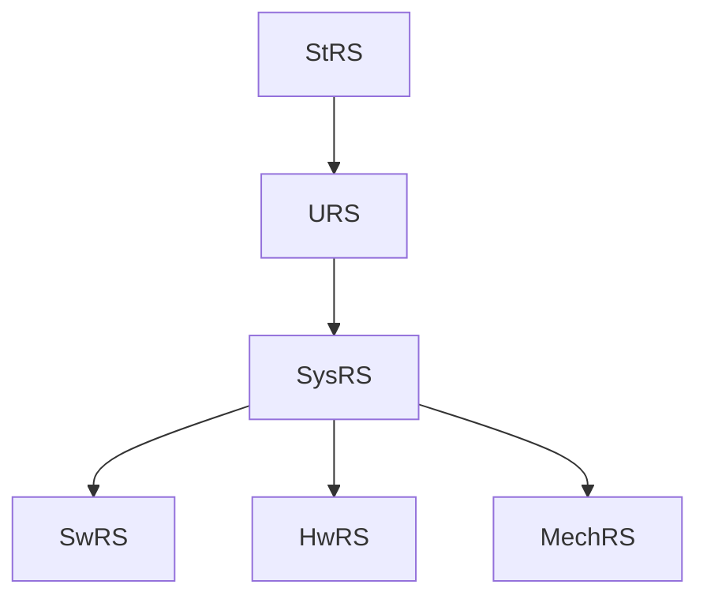

# Project Documentation and Traceability Standard

## Table of Contents

- [Project Documentation and Traceability Standard](#project-documentation-and-traceability-standard)
  - [Table of Contents](#table-of-contents)
  - [Quick Reference](#quick-reference)
  - [1. Introduction](#1-introduction)
    - [1.1 General Standards](#11-general-standards)
    - [1.2 Security by Design Standards](#12-security-by-design-standards)
  - [2. Documentation Types](#2-documentation-types)
    - [2.1 Requirements Specifications](#21-requirements-specifications)
    - [2.2 Test Plans](#22-test-plans)
    - [2.3 Test Reports](#23-test-reports)
    - [2.4 Traceability Documents](#24-traceability-documents)
    - [2.5 Project Management and Planning Documents](#25-project-management-and-planning-documents)
    - [2.6 Architecture and Design Documents](#26-architecture-and-design-documents)
    - [2.7 Operational and Lifecycle Documents](#27-operational-and-lifecycle-documents)
    - [2.8 Change Management and Defect Tracking Documents](#28-change-management-and-defect-tracking-documents)
    - [2.9 Risk and Compliance Documents](#29-risk-and-compliance-documents)
    - [2.10 Product Requirements Document](#210-product-requirements-document)
    - [2.11 Hardware and Mechanical Development Lifecycle Phases](#211-hardware-and-mechanical-development-lifecycle-phases)
  - [3. Naming Convention](#3-naming-convention)
    - [3.1 Requirements Naming Convention](#31-requirements-naming-convention)
    - [3.2 Test Plan Naming Convention](#32-test-plan-naming-convention)
    - [3.3 Test Report Naming Convention](#33-test-report-naming-convention)
    - [3.4 Interface Control Document Naming Convention](#34-interface-control-document-naming-convention)
    - [3.5 Concept of Operations Naming Convention](#35-concept-of-operations-naming-convention)
    - [3.6 Architecture Decision Record Naming Convention](#36-architecture-decision-record-naming-convention)
    - [3.7 Project Management and Planning Document Naming Convention](#37-project-management-and-planning-document-naming-convention)
    - [3.8 Architecture and Design Document Naming Convention](#38-architecture-and-design-document-naming-convention)
    - [3.9 Operational and Lifecycle Document Naming Convention](#39-operational-and-lifecycle-document-naming-convention)
    - [3.10 Change Management and Defect Document Naming Convention](#310-change-management-and-defect-document-naming-convention)
    - [3.11 Traceability Document Naming Convention](#311-traceability-document-naming-convention)
    - [3.12 Risk and Compliance Document Naming Convention](#312-risk-and-compliance-document-naming-convention)
    - [3.13 Product Requirements Document Naming Convention](#313-product-requirements-document-naming-convention)
  - [4. Hierarchy and Traceability](#4-hierarchy-and-traceability)
    - [4.1 Traceability Matrix](#41-traceability-matrix)
    - [4.2 Bidirectional Traceability in Markdown](#42-bidirectional-traceability-in-markdown)
  - [5. Requirement Types](#5-requirement-types)
    - [5.1 Requirement States](#51-requirement-states)
    - [5.2 Document States (Non-Requirement Documents)](#52-document-states-non-requirement-documents)
  - [6. Versioning](#6-versioning)
    - [6.1 Document-Level vs. Item-Level Versioning](#61-document-level-vs-item-level-versioning)
    - [6.2 Change Control](#62-change-control)
  - [7. Examples](#7-examples)
    - [7.1 Complete Traceability Chain](#71-complete-traceability-chain)
    - [7.2 Cross-Discipline Integration Example](#72-cross-discipline-integration-example)
  - [8. Best Practices for Writing Requirements and Test Plans](#8-best-practices-for-writing-requirements-and-test-plans)
    - [8.1 Requirements](#81-requirements)
    - [8.2 Test Plans](#82-test-plans)
    - [8.2.1 Test Level Coordination (SVVP)](#821-test-level-coordination-svvp)
    - [8.2.2 BDD (Behavior-Driven Development) Integration](#822-bdd-behavior-driven-development-integration)
    - [8.3 Test Reports](#83-test-reports)
    - [8.4 Common Pitfalls to Avoid](#84-common-pitfalls-to-avoid)
  - [9. Tools and Templates](#9-tools-and-templates)
    - [9.1 Recommended Tools](#91-recommended-tools)
    - [9.2 Templates](#92-templates)
  - [Documentation Templates](#documentation-templates)
  - [10. Review and Approval Process](#10-review-and-approval-process)
    - [10.1 Review Checklist](#101-review-checklist)
    - [10.2 Approval Authorities](#102-approval-authorities)
    - [10.3 RACI Matrix for Documentation Activities](#103-raci-matrix-for-documentation-activities)
  - [11. Documentation Lifecycle Management](#11-documentation-lifecycle-management)
    - [11.1 Storage and Access](#111-storage-and-access)
    - [11.2 Maintenance](#112-maintenance)
    - [11.3 Backup and Recovery](#113-backup-and-recovery)
    - [11.4 Repository Folder Structure](#114-repository-folder-structure)
  - [12. Markdown-as-Source Conventions](#12-markdown-as-source-conventions)
    - [12.1 YAML Frontmatter](#121-yaml-frontmatter)
    - [12.2 Diagrams](#122-diagrams)
    - [12.3 Admonitions](#123-admonitions)
    - [12.4 Markdown Linting](#124-markdown-linting)
  - [13. Metrics and Quality Assurance](#13-metrics-and-quality-assurance)
    - [13.1 Documentation Quality Metrics](#131-documentation-quality-metrics)
    - [13.2 Quality Assurance Activities](#132-quality-assurance-activities)
    - [13.3 Automation and Tooling](#133-automation-and-tooling)
  - [14. Conclusion](#14-conclusion)
  - [Revision History](#revision-history)
  - [Change Request Log Template](#change-request-log-template)
  - [Defect Log Template](#defect-log-template)
  - [Software Bill of Materials Template](#software-bill-of-materials-template)
  - [Electronic Design Description Template](#electronic-design-description-template)
  - [Mechanical Design Description Template](#mechanical-design-description-template)
  - [Hardware Bill of Materials Template](#hardware-bill-of-materials-template)
  - [Engineering Change Order Template](#engineering-change-order-template)
  - [Product Requirements Document Template](#product-requirements-document-template)
  - [Project Document Registry](#project-document-registry)
    - [Governance and Planning Documents](#governance-and-planning-documents)
    - [Requirements Documents](#requirements-documents)
    - [Architecture and Design Documents](#architecture-and-design-documents)
    - [Risk, Safety, and Security Documents](#risk-safety-and-security-documents)
    - [Verification and Validation Documents](#verification-and-validation-documents)
    - [Traceability Documents](#traceability-documents)
    - [Change Management Documents](#change-management-documents)
    - [Operational and Release Documents](#operational-and-release-documents)
  - [10. Review and Approval Process](#10-review-and-approval-process)
    - [10.1 Review Checklist](#101-review-checklist)
    - [10.2 Approval Authorities](#102-approval-authorities)
    - [10.3 RACI Matrix for Documentation Activities](#103-raci-matrix-for-documentation-activities)
  - [11. Documentation Lifecycle Management](#11-documentation-lifecycle-management)
    - [11.1 Storage and Access](#111-storage-and-access)
    - [11.2 Maintenance](#112-maintenance)
    - [11.3 Backup and Recovery](#113-backup-and-recovery)
    - [11.4 Repository Folder Structure](#114-repository-folder-structure)
  - [12. Metrics and Quality Assurance](#12-metrics-and-quality-assurance)
    - [12.1 Documentation Quality Metrics](#121-documentation-quality-metrics)
    - [12.2 Quality Assurance Activities](#122-quality-assurance-activities)
    - [12.3 Automation and Tooling](#123-automation-and-tooling)
      - [12.3.1 Traceability Validation Script](#1231-traceability-validation-script)
      - [12.3.2 RTM Auto-Generation](#1232-rtm-auto-generation)
      - [12.3.3 CI/CD Integration](#1233-cicd-integration)
      - [12.3.4 Recommended Tools](#1234-recommended-tools)
  - [13. Conclusion](#13-conclusion)

---

## Quick Reference

> [!TIP]
> This table provides a fast look-up of all document types, their ID prefixes, and the section where they are defined.

| Category | Doc Types | ID Format | Section |
|----------|-----------|-----------|---------|
| **Product** | PRD | `PRD-PROJ-ProductName-v` | §2.10, §3.13 |
| **Requirements** | StRS, URS, SysRS, SwRS, HwRS, MechRS | `XyzRS-PROJ-Type-nnnn-v` | §2.1, §3.1 |
| **Safety / Security** | SafetyRS, SecRS | `XyzRS-PROJ-Type-nnnn-v` | §2.1, §3.1 |
| **Test Plans** | StRTP, URTP, SysRTP, SwTP, HwTP, MechTP, SafetyTP, SecTP | `XyzTP-PROJ-nnnn-v` | §2.2, §3.2 |
| **Test Reports** | StRTR, URTR, SysRTR, SwTR, HwTR, MechTR, SafetyTR, SecTR | `XyzTR-PROJ-XyzTP-nnnn-v` | §2.3, §3.3 |
| **Architecture** | SAD, SArchD, SDD, ElecDD, MechDD, HwBOM, DATADICT | `DOCTYPE-PROJ-Descriptor-v` | §2.6, §3.8 |
| **Interface** | ICD, ConOps, ADR | `DOCTYPE-PROJ-Descriptor-v` | §2.1, §3.4–3.6 |
| **Planning** | PMP, SDP, SCMP, SQAP, SVVP | `DOCTYPE-PROJ-v` | §2.5, §3.7 |
| **Traceability** | RTM, TTM, TRTM | `DOCTYPE-PROJ-v` | §2.4, §3.11 |
| **Change Mgmt** | CHG, DEF, ECO | `DOCTYPE-PROJ-v` | §2.8, §3.10 |
| **Risk** | RISK, SEC, SAF, REL | `DOCTYPE-PROJ-v` | §2.9, §3.12 |
| **Operational** | RELNOTES, SBOM, INST, OPS, SRV | `DOCTYPE-PROJ-v` | §2.7, §3.9 |

**Key conventions:**
- All documents are **markdown files** (`.md`) — see [§12 Markdown-as-Source](#12-markdown-as-source-conventions)
- Every template includes **YAML frontmatter** for machine-parseable metadata
- Traceability is **bidirectional** — see [§4.2 Bidirectional Traceability](#42-bidirectional-traceability-in-markdown)
- Requirement types: **M**andatory, **R**ecommended, **O**ptional, **E**nvironmental, **C**onstraint — see [§5](#5-requirement-types)

---

## 1. Introduction

This document establishes a standardized approach for creating, organizing, and maintaining **all** project documentation to ensure consistency, clarity, and traceability across all project artifacts. It covers the full documentation lifecycle: product definition (PRD), project planning and governance (PMP, SDP, SCMP, SQAP, SVVP), requirements specifications at all levels (StRS, URS, SysRS, SwRS, HwRS, SafetyRS, SecRS), architecture and design (SAD, SArchD, SDD, DATADICT), interface definitions (ICD), test plans and reports, traceability matrices (RTM, TTM), change management (CHG, DEF), risk and compliance (RISK, SEC, SAF, REL), and operational/release documentation (INST, OPS, SRV, RELNOTES, SBOM). It provides a structured framework to manage, validate, and trace these artifacts from product vision through deployment to sustainment.

**Purpose**:
  To enable project teams to track requirements from initial user needs to final implementation and testing, ensuring alignment with project goals and compliance with applicable standards.

**Scope**:
  This standard applies to all project documentation, including requirements and test plans at the user, system, and software levels.

**Benefits**:
  - Improved compliance with industry regulations and standards
  - Enhanced stakeholder communication and alignment
  - Reduced development errors and rework
  - Facilitated auditing and verification processes
  - Streamlined knowledge transfer between team members

### 1.1 General Standards

1. **ISO/IEC/IEEE 12207:2017 Systems and software engineering — Software life cycle processes**:
   - This standard provides a comprehensive set of processes for the entire software life cycle, including acquisition, supply, development, operation, and maintenance.
   - It covers processes such as requirements analysis, design, implementation, testing, and maintenance, which are essential for software development.

2. **ISO/IEC/IEEE 15288:2015 Systems and Software Engineering - System Life Cycle Processes**:
   - This standard complements ISO/IEC/IEEE 12207 by providing a broader perspective on the system life cycle processes, including both hardware and software components.
   - It covers processes for the conception, development, production, utilization, support, and retirement of systems, ensuring a holistic approach to system design and development.

3. **ISO/IEC/IEEE 29148:2018 Systems and Software Engineering - Life Cycle Processes - Requirements Engineering**:
   - This standard focuses specifically on the requirements engineering processes, which are crucial for ensuring that the system or software meets the stakeholder needs and requirements.
   - It covers processes such as requirements elicitation, analysis, specification, validation, and management.

4. **ISO/IEC/IEEE 24765:2017 Systems and Software Engineering - Vocabulary**:
   - While not a process standard, this vocabulary provides a common set of terms and definitions used in systems and software engineering, ensuring consistent communication and understanding among stakeholders.
   - It serves as a reference for the terminology used in the other standards mentioned.

5. **ISO/IEC/IEEE 42010:2011 Systems and Software Engineering - Architecture Description**:
   - This standard provides a conceptual model and best practices for describing the architecture of systems and software.
   - It covers the roles, responsibilities, and processes involved in creating, documenting, and evaluating architecture descriptions, which are essential for system design.

### 1.2 Security by Design Standards

The following additional standards are recommended. These selections prioritize freely accessible or open resources where possible, drawing from reputable sources such as NIST, OWASP, NASA, INCOSE, and others.
Each is briefly described, including its purpose, key coverage, and accessibility details.

1. **NIST SP 800-160 Volume 1: Systems Security Engineering – Considerations for a Multidisciplinary Approach in the Engineering of Trustworthy Secure Systems (Revision 1, 2018, with updates)**:
   - This standard provides engineering-driven principles and processes for developing secure and resilient systems, integrating security into hardware, software, firmware, and mechanical components throughout the lifecycle.
   - It emphasizes security by design, including threat modeling, resilience engineering, and assurance techniques applicable to embedded systems and Linux-based environments.
   - Accessibility: Freely downloadable as a PDF from the NIST website (https://csrc.nist.gov/publications/detail/sp/800-160/vol-1/final).

2. **NIST SP 800-218: Secure Software Development Framework (SSDF) Version 1.1 (2022)**:
   - This framework outlines secure software development practices to minimize vulnerabilities, covering requirements, design, implementation, testing, and deployment for software and firmware.
   - It supports integration with hardware and mechanical elements in complex systems, with a focus on supply chain security and secure coding for embedded Linux applications.
   - Accessibility: Freely available as a PDF from the NIST website (https://csrc.nist.gov/publications/detail/sp/800-218/final).

3. **OWASP Secure by Design Framework (Latest version, ongoing project)**:
   - This framework guides the incorporation of security into software and system architecture from the outset, including threat modeling, secure design patterns, and validation processes.
   - It is particularly useful for software applications and embedded systems, addressing security in firmware and hardware-software interfaces.
   - Accessibility: Open and free resource hosted on the OWASP website (https://owasp.org/www-project-secure-by-design-framework/), with collaborative updates.

4. **OWASP Embedded Application Security Project (Latest version, ongoing project)**:
   - This project provides guidelines for securing embedded devices and applications, including hardware-firmware interactions, secure boot processes, and vulnerability management in Linux-based systems.
   - It focuses on practical security by design for resource-constrained environments, complementing mechanical and electronic integration.
   - Accessibility: Open and free documentation available on the OWASP website (https://owasp.org/www-project-embedded-application-security/).

5. **INCOSE Systems Engineering Body of Knowledge (SEBoK) (Version 2.7, 2023)**:
   - This comprehensive knowledge base covers the full spectrum of systems engineering, including integration of hardware, software, mechanical, and firmware components, with processes for lifecycle management, risk analysis, and traceability.
   - It extends beyond your existing standards by addressing interdisciplinary aspects, such as human-system integration and security considerations in complex systems.
   - Accessibility: Freely accessible online as a wiki (https://www.sebokwiki.org/), with no registration required.

6. **NASA Systems Engineering Handbook (Revision 2, 2016, with updates)**:
   - This handbook details processes for systems engineering in complex projects, encompassing requirements management, design, verification, validation, and risk management across hardware, software, mechanical, and embedded elements.
   - It includes guidance on security and reliability, making it suitable for secured-by-design approaches in multidisciplinary systems.
   - Accessibility: Freely downloadable as a PDF from the NASA website (https://www.nasa.gov/nasa-systems-engineering-handbook/).

7. **UEFI Specification (Version 2.10, 2022)**:
   - This standard defines interfaces for firmware in computing systems, ensuring secure boot, runtime services, and interoperability between hardware, firmware, and operating systems like embedded Linux.
   - It supports security by design through features like measured boot and firmware updates, applicable to single-board computers and electronic hardware.
   - Accessibility: Freely downloadable from the UEFI Forum website (https://uefi.org/specifications), with optional free registration for access.

8. **SGET Embedded Computing Standards (e.g., SMARC 2.1, Qseven 2.1, OSM 1.1, latest versions)**:
   - These open specifications standardize modular embedded hardware designs, including processor modules, interfaces, and mechanical form factors for integration with firmware, software, and Linux-based systems.
   - They promote interoperability and security in hardware design, addressing gaps in mechanical and electronic aspects of complex systems.
   - Accessibility: Open standards freely available for download from the SGET website (https://sget.org/standards/), developed by a non-profit organization.


---

## 2. Documentation Types

The following document types are defined to capture requirements and their validation:

### 2.1 Requirements Specifications

#### Core Requirements Documents:
- **`StRS`**: Stakeholder Requirements Specification
  - **Priority**: HIGH
  - **Purpose**: Capture business/stakeholder needs before technical requirements
  - **Position in V-Model**: Highest level of requirements (above URS)
  - **Contains**: Business objectives, stakeholder needs, constraints, success criteria

- **`URS`**: User Requirements Specification
  - **Priority**: HIGH
  - **Purpose**: High-level needs from the user's perspective
  - **Position in V-Model**: User-level requirements
  - **Contains**: User needs, operational requirements, usability requirements

- **`SysRS`**: System Requirements Specification
  - **Priority**: HIGH
  - **Purpose**: System-level technical requirements
  - **Position in V-Model**: System design level
  - **Contains**: System architecture, performance, interfaces, integration requirements

- **`SwRS`**: Software Requirements Specification
  - **Priority**: HIGH
  - **Purpose**: Detailed software-specific requirements
  - **Position in V-Model**: Software implementation level
  - **Contains**: Software functions, algorithms, data structures, software interfaces

#### Specialized Requirements Documents:

- **`SafetyRS`**: Safety Requirements Specification
  - **Priority**: CRITICAL (mandatory for safety-critical unmanned systems)
  - **Purpose**: Dedicated safety requirements derived from hazard analysis
  - **Compliance**: ISO 13849, IEC 61508, ISO 26262, ISO 10218 (as applicable)
  - **Contains**: Safety functions, risk mitigation, fail-safe mechanisms, emergency procedures
  - **Traceability**: Links to FMEA, Hazard Analysis, Risk Assessments

- **`SecRS`**: Security Requirements Specification
  - **Priority**: CRITICAL (mandatory for security-by-design approach)
  - **Purpose**: Cybersecurity and physical security requirements
  - **Standards**: NIST SP 800-160, IEC 62443, ISO/IEC 27001
  - **Contains**: Authentication, authorization, encryption, secure boot, threat modeling
  - **Integration**: References NIST SSDF, OWASP guidelines

- **`HwRS`**: Hardware Requirements Specification (Electronics)
  - **Priority**: HIGH
  - **Purpose**: Electronic hardware requirements derived from system architecture, covering circuit design, PCB, component selection, power, EMC, and environmental constraints
  - **Contains**: Electrical specifications, component derating rules, power budgets, signal integrity requirements, EMC/EMI targets, thermal limits, environmental conditions (temperature, humidity, vibration, IP rating), PCB stack-up constraints, DFM/DFT requirements
  - **Standards**: IPC-2221/2222 (PCB design), IPC-7351 (footprints), IPC-610 (assembly quality), ISO 26262 / IEC 61508 (functional safety)
  - **Traceability**: SysRS → HwRS → HwTP → HwTR
  - **Relationship to MechRS**: HwRS covers electronic/electrical hardware; MechRS covers mechanical/structural hardware. Both derive from SysRS and are coordinated through ICD for electromechanical interfaces

- **`MechRS`**: Mechanical Requirements Specification
  - **Priority**: HIGH (mandatory for systems with custom mechanical design)
  - **Purpose**: Mechanical and structural hardware requirements derived from system architecture, covering frame design, enclosures, mechanisms, materials, manufacturing, and environmental resilience
  - **Contains**: Structural load requirements (static, dynamic, fatigue), dimensional and tolerance specifications, material selection criteria, mass budgets, environmental resilience (IP rating, shock, vibration, thermal cycling), kinematic and clearance requirements, DFM/DFA constraints, surface finish and coating requirements, manufacturability (3D printing, CNC, injection molding, composite layup)
  - **Standards**: ISO GPS (Geometrical Product Specifications), ASME Y14.5 (GD&T), ISO 2768 (general tolerances), EN/ISO machinery safety standards
  - **Traceability**: SysRS → MechRS → MechTP → MechTR
  - **Relationship to HwRS**: MechRS addresses physical structure and mechanisms; HwRS addresses electronic circuits. Both coordinate through ICD for mounting, thermal interfaces, connector cutouts, and cable routing

#### Supporting Documents:

- **`ICD`**: Interface Control Document
  - **Priority**: HIGH
  - **Purpose**: Define interfaces between systems, subsystems, and external entities
  - **Criticality**: Essential for unmanned systems with multiple subsystems
  - **Contains**: Interface specifications, protocols, data formats, timing, electrical/mechanical interfaces

- **`ConOps`**: Concept of Operations (Operational Requirements Document)
  - **Priority**: HIGH
  - **Purpose**: Define how the system will be operated, deployed, and maintained
  - **Contains**: Operational scenarios, user workflows, deployment environments, maintenance concepts
  - **Benefits**: Bridges gap between stakeholder needs and system requirements

- **`SDD`**: Software Design Description (Design Requirements Specification)
  - **Priority**: MEDIUM
  - **Purpose**: Bridge between SwRS and implementation
  - **Contains**: Detailed design, class diagrams, algorithms, data structures
  - **Standards**: IEEE 1016

- **`ADR`**: Architecture Decision Record
  - **Priority**: MEDIUM-HIGH
  - **Purpose**: Document significant architectural decisions and their rationale
  - **Contains**: Context, decision, consequences, alternatives considered, trade-offs
  - **Benefits**: Preserves institutional knowledge, enables informed future decisions
  - **Traceability**: Links to affected SysRS, SwRS, HwRS requirements

### 2.2 Test Plans

- **`StRTP`**: Stakeholder Requirements Test Plan - Validates `StRS`
- **`URTP`**: User Requirements Test Plan - Validates `URS`
- **`SysRTP`**: System Requirements Test Plan - Validates `SysRS`
- **`SwTP`**: Software Test Plan - Validates `SwRS`
- **`SafetyTP`**: Safety Test Plan - Validates `SafetyRS`
- **`SecTP`**: Security Test Plan - Validates `SecRS`
- **`HwTP`**: Hardware Test Plan (Electronics) - Validates `HwRS`
  - **Scope**: EMC/EMI testing, signal integrity, power integrity, thermal validation, environmental stress screening (ESS), ICT/JTAG/boundary scan, HALT/HASS, reliability testing
  - **Phases**: Covers EVT (Engineering Validation Test), DVT (Design Validation Test), and PVT (Production Validation Test) for electronic assemblies
- **`MechTP`**: Mechanical Test Plan - Validates `MechRS`
  - **Scope**: FEA/CFD correlation testing, structural load tests, vibration and shock tests, thermal cycling, IP rating validation, drop tests, fatigue and endurance testing, tolerance stack-up verification, fit/form/function checks, DFM/DFA review validation
  - **Phases**: Covers EVT (prototype fit/form/function), DVT (environmental and endurance validation), and PVT (production tooling and assembly validation) for mechanical assemblies

### 2.3 Test Reports

- **`StRTR`**: Stakeholder Requirements Test Report - Results from `StRTP`
- **`URTR`**: User Requirements Test Report - Results from `URTP`
- **`SysRTR`**: System Requirements Test Report - Results from `SysRTP`
- **`SwTR`**: Software Test Report - Results from `SwTP`
- **`SafetyTR`**: Safety Test Report - Results from `SafetyTP`
- **`SecTR`**: Security Test Report - Results from `SecTP`
- **`HwTR`**: Hardware Test Report (Electronics) - Results from `HwTP`
- **`MechTR`**: Mechanical Test Report - Results from `MechTP`

### 2.4 Traceability Documents

- **`RTM`**: Requirements Traceability Matrix
  - **Priority**: HIGH
  - **Purpose**: Standalone document showing complete traceability
  - **Format**: Matrix/spreadsheet showing StRS → URS → SysRS → SwRS/HwRS/SafetyRS/SecRS → Test Cases
  - **Benefits**: Auditor-friendly, gap analysis, impact assessment

- **`TTM`**: Test Traceability Matrix
  - **Priority**: MEDIUM
  - **Purpose**: Map requirements to test cases and test results
  - **Benefits**: Verification coverage analysis, regression test selection
  - **Links**: Requirements → Test Cases → Test Results → Defects

- **`TRTM`**: Threats Requirements Traceability Matrix
  - **Priority**: HIGH (CRITICAL for security-critical systems)
  - **Purpose**: Map identified threats from the threat model (SEC) to mitigating security requirements (SecRS), and from those requirements to verification evidence (SecTP/SecTR)
  - **Benefits**: Threat coverage analysis, security assurance argumentation, audit evidence for IEC 62443 / NIST SP 800-160 / ISO 15408 compliance
  - **Links**: Threat → SecRS (mitigating requirement) → SecTP (verification test) → SecTR (test result) → Residual Risk
  - **Relationship**: SEC (threat model) → TRTM → SecRS → SecTP → SecTR; complements RTM by adding the threat dimension
  - **Standards**: NIST SP 800-160 Vol. 1 (threat-driven assurance), IEC 62443-4-1 (security development lifecycle), ISO/IEC 15408 (Common Criteria threat-to-SFR mapping)

### 2.5 Project Management and Planning Documents

These documents form the governance layer above requirements and must be established at project inception:

- **`PMP`**: Project Management Plan
  - **Priority**: HIGH
  - **Purpose**: Define project scope, schedule, resources, communication, and governance
  - **Contains**: Project charter, milestones, roles, escalation procedures, budget, stakeholder management
  - **Standards**: PMBOK, ISO 21500

- **`SDP`**: Software Development Plan
  - **Priority**: HIGH
  - **Purpose**: Define the software lifecycle, development methodology, branching strategy, code review processes, CI/CD pipeline, and quality gates
  - **Contains**: Lifecycle model (V-Model, Agile, hybrid), branching strategy (e.g., Gitflow), code review policies, CI/CD pipeline configuration, build and deployment gates, tool chain
  - **Standards**: ISO/IEC/IEEE 12207, IEEE 1058

- **`SCMP`**: Software Configuration Management Plan
  - **Priority**: HIGH
  - **Purpose**: Define configuration identification, control, status accounting, and audit procedures
  - **Contains**: Baseline definitions, version control strategy, configuration item identification, release packaging and labeling, build reproducibility, branch policies
  - **Standards**: ISO/IEC/IEEE 12207 Section 6.3, IEEE 828

- **`SQAP`**: Software Quality Assurance Plan
  - **Priority**: HIGH
  - **Purpose**: Define quality processes, reviews, audits, and metrics throughout the project lifecycle
  - **Contains**: Review and audit schedule, quality metrics and thresholds, defect handling procedures, process compliance checks, tool qualification
  - **Standards**: ISO/IEC/IEEE 12207 Section 6.2, IEEE 730

- **`SVVP`**: Software Verification and Validation Plan
  - **Priority**: HIGH
  - **Purpose**: Umbrella plan that coordinates all verification and validation activities across levels
  - **Contains**: V&V strategy, test level coordination (URTP/URTR for acceptance/BDD, SysRTP/SysRTR for integration/verification, SwTP/SwTR for unit/component), independence requirements, tools, entry/exit criteria per test level
  - **Standards**: ISO/IEC/IEEE 12207, IEEE 1012
  - **Relationship**: Parent document for all test plans (URTP, SysRTP, SwTP, HwTP, SafetyTP, SecTP)

### 2.6 Architecture and Design Documents

These documents capture architectural decisions and detailed design, keeping requirements specifications (SysRS, SwRS) focused on *what* the system must do, not *how* it is structured:

- **`SAD`**: System Architecture Description
  - **Priority**: HIGH
  - **Purpose**: Document the system-level architecture: views, viewpoints, components, interfaces, and design rationale per ISO/IEC/IEEE 42010
  - **Contains**: Context diagrams, component diagrams, deployment views, technology stack decisions, quality attribute trade-offs
  - **Standards**: ISO/IEC/IEEE 42010:2011
  - **Note**: Keep SysRS requirements-focused; architectural decisions belong here and in ADRs

- **`SArchD`**: Software Architecture Document
  - **Priority**: HIGH
  - **Purpose**: Document the software-level architecture: layers, modules, service boundaries, concurrency model, and key patterns
  - **Contains**: Logical view, process view, deployment view, key design patterns, technology choices, dependency map
  - **Note**: Keep SwRS requirements-focused; detailed software architecture belongs here

- **`SDD`**: Software Design Description (already defined in Section 2.1)
  - **Relationship to SArchD**: SDD provides module-level detailed design (API specifications, sequence diagrams, state machines, resource budgets), while SArchD provides the higher-level software architecture
  - **Standards**: IEEE 1016

- **`DATADICT`**: Data Dictionary
  - **Priority**: MEDIUM-HIGH
  - **Purpose**: Central reference for all data entities, attributes, types, constraints, and relationships used across the system
  - **Contains**: Entity definitions, field types and ranges, validation rules, data flows, database schemas, message payload definitions
  - **Traceability**: Referenced by ICD, SDD, SwRS for data-related requirements

- **`ElecDD`**: Electronic Design Description
  - **Priority**: HIGH (mandatory for projects with custom electronic hardware)
  - **Purpose**: Document the electronic hardware detailed design: schematics, PCB layout decisions, component selection rationale, power architecture, and signal integrity analysis
  - **Contains**: Schematic design and review notes, component selection with derating analysis and lifecycle status, PCB stack-up definition, critical net routing constraints, power tree and distribution architecture, SI/PI simulation results, thermal analysis and derating, DFM/DFT design rules, test point and debug access strategy
  - **Standards**: IPC-2221/2222 (PCB design), IPC-7351 (footprints), IPC-610 (assembly quality)
  - **Relationship to HwRS**: ElecDD captures *how* the electronic design meets HwRS requirements (analogous to SDD for SwRS)
  - **Traceability**: HwRS → ElecDD → HwTP (board-level tests validate ElecDD design)

- **`MechDD`**: Mechanical Design Description
  - **Priority**: HIGH (mandatory for projects with custom mechanical design)
  - **Purpose**: Document the mechanical detailed design: CAD architecture, assembly strategy, tolerance analysis, material selection rationale, and manufacturing approach
  - **Contains**: 3D CAD model architecture (assemblies, sub-assemblies, part hierarchy), 2D engineering drawings with GD&T per ASME Y14.5, tolerance stack-up analysis, material selection rationale and datasheets, mass budget and center-of-gravity analysis, kinematic and mechanism design notes, FEA/CFD simulation setup and results, DFM/DFA assessment, manufacturing process selection (3D printing, CNC, injection molding, composite layup, sheet metal), surface treatment and coating specifications
  - **Standards**: ASME Y14.5 (GD&T), ISO 2768 (general tolerances), ISO GPS series
  - **Relationship to MechRS**: MechDD captures *how* the mechanical design meets MechRS requirements (analogous to SDD for SwRS)
  - **Traceability**: MechRS → MechDD → MechTP (physical tests validate MechDD design)

- **`HwBOM`**: Hardware Bill of Materials
  - **Priority**: HIGH (mandatory for manufactured hardware)
  - **Purpose**: Comprehensive inventory of all physical components, materials, and assemblies required to manufacture the hardware product
  - **Contains**: Component name, manufacturer, manufacturer part number (MPN), approved manufacturer list (AML) with alternates, quantity per assembly, reference designator (electronics) or part number (mechanical), unit cost, lead time, lifecycle status (active/NRND/obsolete), RoHS/REACH compliance, critical component flags
  - **Distinction from SBOM**: SBOM covers software/firmware components and licenses; HwBOM covers physical parts, materials, and manufactured assemblies
  - **Traceability**: ElecDD → HwBOM (electronic components), MechDD → HwBOM (mechanical parts and raw materials)
  - **Integration**: Referenced by procurement, manufacturing, and supply chain management

### 2.7 Operational and Lifecycle Documents

These documents support deployment, operations, maintenance, and end-of-life activities:

- **`INST`**: Installation and Commissioning Guide
  - **Priority**: HIGH
  - **Purpose**: Step-by-step instructions for system installation, initial configuration, and commissioning verification
  - **Contains**: Prerequisites, installation procedures, configuration checklists, commissioning test procedures, acceptance sign-off

- **`OPS`**: Operations Manual
  - **Priority**: HIGH
  - **Purpose**: Day-to-day operating procedures for system operators
  - **Contains**: Startup/shutdown procedures, normal operation workflows, monitoring and alerting, operator roles and responsibilities

- **`SRV`**: Service and Diagnostics Guide
  - **Priority**: MEDIUM-HIGH
  - **Purpose**: Maintenance, troubleshooting, and diagnostics procedures for field service personnel
  - **Contains**: Diagnostic procedures, fault codes and resolution, preventive maintenance schedules, replacement part procedures, field-upgradeable firmware procedures

- **`RELNOTES`**: Release Notes
  - **Priority**: HIGH
  - **Purpose**: Document changes, fixes, known issues, and upgrade instructions for each release
  - **Contains**: Version identifier, date, new features, bug fixes, known issues, breaking changes, upgrade/migration instructions, dependencies

- **`SBOM`**: Software Bill of Materials
  - **Priority**: HIGH (mandatory for supply chain security)
  - **Purpose**: Comprehensive inventory of all software components, libraries, and dependencies
  - **Contains**: Component name, version, license, supplier, hash/checksum, known vulnerabilities (CVE references)
  - **Standards**: NTIA SBOM Minimum Elements, SPDX, CycloneDX
  - **Integration**: Referenced by SecRS for supply chain security requirements

### 2.8 Change Management and Defect Tracking Documents

- **`CHG`**: Change Request Log
  - **Priority**: HIGH
  - **Purpose**: Formal record of all change requests, their evaluation, approval, and implementation status
  - **Contains**: Change ID, requester, date, description, impact assessment, affected documents/requirements, approval status, implementation status
  - **Relationship**: Drives version increments in requirements, test plans, and design documents

- **`DEF`**: Defect Log and Triage
  - **Priority**: HIGH
  - **Purpose**: Track all defects from discovery through resolution, with triage prioritization
  - **Contains**: Defect ID, severity, priority, description, steps to reproduce, affected requirement/test, root cause, resolution, verification status
  - **Relationship**: Links to test reports (failures), change requests, and requirements

- **`ECO`**: Engineering Change Order / Engineering Change Notice
  - **Priority**: HIGH (mandatory for projects with manufactured hardware)
  - **Purpose**: Formal record of engineering changes to hardware (electronic and mechanical) designs, including impact assessment, approval, and implementation tracking
  - **Contains**: ECO/ECN ID, change originator, affected assemblies and part numbers, change description (before/after), reason for change (corrective, cost reduction, obsolescence, improvement), impact assessment (BOM, tooling, inventory, certification, interchangeability), affected documents (ElecDD, MechDD, HwBOM, ICD, HwRS, MechRS), disposition of existing stock, approval chain (engineering, quality, manufacturing, procurement), implementation date, verification status
  - **Distinction from CHG**: CHG covers all document-level change requests broadly; ECO specifically governs physical hardware design changes that affect manufactured parts, tooling, and supply chain
  - **Standards**: ISO 10007 (Configuration Management), industry ECO/ECN best practices
  - **Relationship**: ECO may trigger CHG entries for related documentation updates; ECO links to HwBOM revisions and HwTP/MechTP revalidation

### 2.9 Risk and Compliance Documents

- **`RISK`**: Risk Register and Mitigation Plan
  - **Priority**: HIGH
  - **Purpose**: Identify, assess, and track project and technical risks with mitigation strategies
  - **Contains**: Risk ID, category (technical, schedule, resource, safety, security), likelihood, impact, risk score, mitigation actions, owner, status
  - **Standards**: ISO 31000, PMI Risk Management
  - **Traceability**: Links to SafetyRS, SecRS, and SysRS where risks drive requirements

- **`SEC`**: Threat Model and Security Plan
  - **Priority**: CRITICAL
  - **Purpose**: Systematic threat analysis and security countermeasure planning (distinct from SecRS which captures individual security requirements)
  - **Contains**: System boundaries, trust zones, threat actors, attack trees/STRIDE analysis, data flow diagrams, countermeasure mapping, residual risk assessment
  - **Standards**: NIST SP 800-154, OWASP Threat Modeling, STRIDE/DREAD
  - **Relationship**: SEC informs SecRS requirements; SecRS implements mitigations identified in SEC

- **`SAF`**: Safety Requirements and Analysis
  - **Priority**: CRITICAL (for safety-critical systems)
  - **Purpose**: Comprehensive safety analysis document encompassing hazard identification, risk assessment, and safety case argumentation
  - **Contains**: Hazard log, FMEA/FMECA results, fault tree analysis, safety case (claims, arguments, evidence), residual risk acceptance
  - **Standards**: ISO 13849, IEC 61508, MIL-STD-882E
  - **Relationship**: SAF informs SafetyRS requirements; SafetyTP validates the safety case

- **`REL`**: Reliability and Stress Test Plan
  - **Priority**: MEDIUM-HIGH
  - **Purpose**: Define reliability targets and stress/endurance testing to validate system robustness
  - **Contains**: MTBF/MTTF targets, accelerated life testing plan, environmental stress screening, reliability demonstration test procedures, degradation analysis
  - **Traceability**: Links to SysRS reliability requirements, HwRS environmental requirements

Each type serves a distinct purpose in the project lifecycle, ensuring comprehensive coverage from stakeholder needs through conception, design, implementation, to verification and validation.

### 2.10 Product Requirements Document

The PRD bridges product management and engineering. It is the **pre-engineering artifact** that defines *what product to build and why*, before formal requirements engineering (StRS, URS) begins. It is authored by product management for non-engineering stakeholders and executive sponsors.

- **`PRD`**: Product Requirements Document
  - **Priority**: HIGH
  - **Purpose**: Define the product vision, target users, feature set with prioritization, success metrics, and product roadmap — answering *what to build and for whom* before the engineering V-model starts
  - **Position in hierarchy**: Above `StRS`; the PRD provides the product-management context from which `StRS` and `ConOps` are derived
  - **Audience**: Executive sponsors, product owners, business analysts, marketing/sales, and engineering leads
  - **Contains**:
    - Product vision and problem statement
    - Target users and personas
    - Feature list with MoSCoW (Must / Should / Could / Won't) prioritization
    - Success metrics and KPIs (e.g., adoption rate, performance thresholds, NPS)
    - Product roadmap and release phasing
    - Explicitly out-of-scope features
    - Competitive context and differentiation
    - Constraints (regulatory, budget, timeline, platform)
  - **Relationship to other documents**:
    - `PRD` → `StRS` (stakeholder requirements derived from product vision)
    - `PRD` → `ConOps` (operational concepts shaped by target use cases)
    - `PRD` → `PMP` (project scope informed by PRD features and roadmap)
  - **Key distinction**: The PRD uses product management vocabulary (epics, personas, MoSCoW, KPIs). Once the `StRS` is authored, formal engineering traceability begins. The PRD is not in the requirements traceability chain but is a key input document.
  - **Standards**: No single governing standard; informed by product management best practices (PDMA, SAFe Lean UX, BABOK v3 Business Requirements)

### 2.11 Hardware and Mechanical Development Lifecycle Phases

For projects involving custom electronic and mechanical hardware (such as custom flight controllers, sensor boards, vehicle frames, and enclosures), the development lifecycle follows a structured phase-gate approach that runs in parallel with and synchronizes to the software V-model. These phases apply to both electronic hardware (HwRS/ElecDD) and mechanical hardware (MechRS/MechDD).

#### 2.11.1 Development Phase Definitions

- **EVT (Engineering Validation Test)**
  - **Purpose**: Validate that the design concept meets functional requirements using early prototypes
  - **Electronics scope**: First-article PCB bring-up, basic functional verification, firmware integration, power-on testing, initial EMC pre-scan
  - **Mechanical scope**: 3D-printed or rapid-prototyped parts, fit/form/function checks, preliminary assembly evaluation, initial kinematic validation
  - **Entry criteria**: ElecDD/MechDD detailed design reviewed and approved, HwRS/MechRS baselined
  - **Exit criteria**: Core functionality demonstrated, critical design flaws identified and documented, EVT test report completed
  - **Deliverables**: EVT prototype units, EVT test report, updated ElecDD/MechDD with corrections, updated HwBOM

- **DVT (Design Validation Test)**
  - **Purpose**: Validate that the design meets all requirements under specified environmental and stress conditions
  - **Electronics scope**: Full EMC/EMI certification testing, environmental testing (temperature, humidity, vibration), power integrity validation, signal integrity measurement, HALT (Highly Accelerated Life Test), reliability demonstration
  - **Mechanical scope**: Structural load testing (static, dynamic, fatigue), drop and shock testing, vibration and resonance testing, thermal cycling, IP rating validation, endurance and wear testing, tolerance verification on production-representative parts
  - **Entry criteria**: EVT issues resolved, design changes incorporated, production-intent materials and processes used
  - **Exit criteria**: All HwRS/MechRS requirements verified, environmental and stress tests passed, certification pre-compliance confirmed
  - **Deliverables**: DVT test report, updated ElecDD/MechDD, certification test data, reliability assessment

- **PVT (Production Validation Test)**
  - **Purpose**: Validate that production tooling, processes, and assembly lines yield conforming product at target quality levels
  - **Electronics scope**: Production test bench validation (ICT, functional test, boundary scan), first-article inspection, yield analysis, calibration procedure verification, production SBOM/HwBOM lock
  - **Mechanical scope**: Tooling validation (injection molds, dies, jigs, fixtures), first-article dimensional inspection, assembly line trial, work instruction verification, quality inspection plan execution (SPC, Cpk analysis), PPAP (Production Part Approval Process) if applicable
  - **Entry criteria**: DVT passed, production tooling available, assembly procedures documented
  - **Exit criteria**: Production yield meets target, first-article inspection passed, work instructions validated, quality plan approved
  - **Deliverables**: PVT test report, production-locked HwBOM, work instructions, quality inspection plan, manufacturing release authorization

#### 2.11.2 Phase-Gate Integration with V-Model

The hardware EVT/DVT/PVT phases map to the right side of the V-model (verification and validation):

```plaintext
V-Model Left Side (Definition)          V-Model Right Side (Verification)
──────────────────────────────────          ─────────────────────────────────────

SysRS (System Requirements)              System Integration Test (SysRTP)
  │                                         ▲
  ├─ HwRS (Electronic HW Reqs)     ──────> HwTP: EVT → DVT → PVT
  │    └─ ElecDD (Schematic/PCB)              │
  │                                          ├─ Board bring-up (EVT)
  │                                          ├─ EMC / Environmental (DVT)
  │                                          └─ Production test (PVT)
  │
  ├─ MechRS (Mechanical HW Reqs)   ──────> MechTP: EVT → DVT → PVT
  │    └─ MechDD (CAD/FEA)                    │
  │                                          ├─ Fit/form/function (EVT)
  │                                          ├─ Stress / Endurance (DVT)
  │                                          └─ Tooling / Production (PVT)
  │
  ├─ SwRS (Software Reqs)         ──────> SwTP: Unit → Integration
  │    └─ SDD (Detailed Design)               │
  │                                          ├─ Unit tests
  │                                          └─ Component tests
  │
  └─ SafetyRS / SecRS              ──────> SafetyTP / SecTP
```

**Synchronization Milestones:**
- **EVT Complete**: Hardware prototypes available for firmware bring-up and initial software integration
- **DVT Complete**: Validated hardware platform for software integration testing (HIL/SIL)
- **PVT Complete**: Production-ready hardware for final system validation and release

#### 2.11.3 Hardware Development Standards Reference

The following standards govern hardware and mechanical development activities:

| Standard | Domain | Coverage |
|----------|--------|----------|
| IPC-2221/2222 | Electronics | PCB design rules and sectoral requirements |
| IPC-7351 | Electronics | Component land pattern (footprint) standards |
| IPC-610 | Electronics | Acceptability of electronic assemblies |
| IPC-A-600 | Electronics | Acceptability of printed boards |
| ISO 26262 / IEC 61508 | Electronics | Functional safety for E/E systems |
| ASME Y14.5 | Mechanical | Geometric Dimensioning and Tolerancing (GD&T) |
| ISO 2768 | Mechanical | General tolerances for linear and angular dimensions |
| ISO GPS series | Mechanical | Geometrical Product Specifications |
| ISO 1101 | Mechanical | Geometrical tolerancing |
| ISO 10007 | Both | Configuration management guidelines |
| AIAG PPAP | Manufacturing | Production Part Approval Process |
| IEC 60529 | Both | IP (Ingress Protection) rating testing |
| MIL-STD-810 | Both | Environmental engineering considerations and test methods |

---

## 3. Naming Convention

A structured naming convention is mandatory for all requirements and test plans to ensure traceability and uniqueness.

### 3.1 Requirements Naming Convention

Requirements use the following format:

```plaintext
XyzRS-PROJ-[Type]-nnnn-v [ParentID-v]
```

#### Breakdown:
- **`XyzRS`**:
  - `StRS`: Stakeholder Requirements Specification
  - `URS`: User Requirements Specification
  - `SysRS`: System Requirements Specification
  - `SwRS`: Software Requirements Specification
  - `SafetyRS`: Safety Requirements Specification
  - `SecRS`: Security Requirements Specification
  - `HwRS`: Hardware Requirements Specification (Electronics)
  - `MechRS`: Mechanical Requirements Specification
- **`PROJ`**: Project initials (e.g., `RAC` for Robotic Arm Controller). Maximum 4 characters, uppercase.

> [!NOTE]
> `SDD` (Software Design Description) is NOT a requirements specification. SDD follows the architecture/design naming convention defined in Section 3.8.
- **`[Type]`**: Requirement type - one of `[C|E|M|R|O]` (see Section 5 for details).
- **`nnnn`**: Unique requirement ID (0001–9999, padded with leading zeros).
- **`v`**: Version number (starts at 1, increments with each update).
- **`[ParentID-v]`**: Optional parent requirement reference(s) in square brackets after the ID, including version number (e.g., `[URS-RAC-M-0001-1]`). Omitted for top-level `StRS` requirements. Multiple parents separated by spaces.

#### Examples:

**Core Requirements:**
- `StRS-RAC-M-0001-1`: Mandatory stakeholder requirement for autonomous operation capability, project RAC, ID 0001, version 1.
- `URS-RAC-M-0001-1` [StRS-RAC-M-0001-1]: Mandatory user requirement for position control derived from stakeholder requirement, ID 0001, version 1.
- `SysRS-RAC-M-0015-1` [URS-RAC-M-0001-1] [URS-RAC-R-0002-1]: Mandatory system requirement for collision detection derived from position control and force feedback requirements, ID 0015, version 1.
- `SwRS-RAC-R-0042-2` [SysRS-RAC-R-0025-1]: Required software requirement for path planning algorithm derived from SysRS-RAC-R-0025-1, ID 0042, version 2.

**Specialized Requirements:**
- `SafetyRS-RAC-M-0001-1` [SysRS-RAC-M-0015-1]: Mandatory safety requirement for emergency stop system per ISO 10218-1, derived from collision detection system requirement, ID 0001, version 1.
- `SecRS-RAC-M-0003-1` [SysRS-RAC-C-0042-1]: Mandatory security requirement for encrypted communication using TLS 1.3, derived from remote operation requirement, ID 0003, version 1.
- `HwRS-RAC-R-0010-1` [SysRS-RAC-M-0010-1]: Required hardware requirement for encoder resolution specification, derived from system-level position control requirement, ID 0010, version 1.
- `MechRS-RAC-M-0001-1` [SysRS-RAC-M-0030-1]: Mandatory mechanical requirement for airframe structural load capacity, derived from system payload requirement, ID 0001, version 1.

### 3.2 Test Plan Naming Convention

Test plans follow this format:

```plaintext
XyzTP-PROJ-nnnn-v [RequirementID-v]
```

#### Breakdown:
- **`XyzTP`**:
  - `StRTP`: Stakeholder Requirements Test Plan
  - `URTP`: User Requirements Test Plan
  - `SysRTP`: System Requirements Test Plan
  - `SwTP`: Software Test Plan
  - `HwTP`: Hardware Test Plan (Electronics)
  - `MechTP`: Mechanical Test Plan
  - `SafetyTP`: Safety Test Plan
  - `SecTP`: Security Test Plan
- **`PROJ`**: Project initials (e.g., `RAC`).
- **`nnnn`**: Unique test ID (0001–9999, padded with leading zeros).
- **`v`**: Version number (starts at 1, increments with updates).
- **`[RequirementID-v]`**: Parent requirement reference in square brackets, including version number.

#### Examples:
- `URTP-RAC-0001-1` [URS-RAC-M-0001-1]: Test plan for position control requirement, test ID 0001, version 1.
- `SysRTP-RAC-0005-1` [SysRS-RAC-M-0015-1]: Test plan for collision detection system, test ID 0005, version 1.
- `SwTP-RAC-0042-1` [SwRS-RAC-R-0042-2]: Test plan for path planning software, test ID 0042, version 1.

### 3.3 Test Report Naming Convention

Test reports follow this format:

```plaintext
XyzTR-PROJ-nnnn-v [XyzTP-PROJ-nnnn-v]
```

#### Breakdown:
- **`XyzTR`**:
  - `StRTR`: Stakeholder Requirements Test Report
  - `URTR`: User Requirements Test Report
  - `SysRTR`: System Requirements Test Report
  - `SwTR`: Software Test Report
  - `HwTR`: Hardware Test Report (Electronics)
  - `MechTR`: Mechanical Test Report
  - `SafetyTR`: Safety Test Report
  - `SecTR`: Security Test Report
- **`PROJ`**: Project initials (e.g., `RAC`).
- **`nnnn`**: Unique test report ID (0001–9999, padded with leading zeros).
- **`v`**: Version number (starts at 1, increments with updates).
- **`[XyzTP-PROJ-nnnn-v]`**: Parent test plan reference in square brackets, including version number.

> [!NOTE]
> Pass/fail status, execution date, individual test case results, and tester identity are recorded **inside the test report document** (see Test Report Template), not in the report ID. Documents are archived per release; the release context provides the temporal reference.

#### Examples:
- `URTR-RAC-0001-1` [URTP-RAC-0001-1]: Test report for position control validation, version 1.
- `SysRTR-RAC-0005-1` [SysRTP-RAC-0005-1]: Test report for collision detection system, version 1.
- `SwTR-RAC-0042-1` [SwTP-RAC-0042-1]: Test report for path planning algorithm, version 1.
- `SafetyTR-RAC-0001-1` [SafetyTP-RAC-0001-1]: Test report for emergency stop validation, version 1.

### 3.4 Interface Control Document Naming Convention

Interface Control Documents follow this format:

```plaintext
ICD-PROJ-[InterfaceName]-v
```

#### Breakdown:
- **`ICD`**: Interface Control Document identifier
- **`PROJ`**: Project initials (e.g., `RAC`)
- **`[InterfaceName]`**: Descriptive name of the interface (e.g., `CAN-MotorCtrl`, `SPI-Sensors`, `Ethernet-RemoteAPI`)
- **`v`**: Version number (starts at 1, increments with updates)

#### Examples:
- `ICD-RAC-CAN-MotorController-1`: Interface control document for CAN bus motor controller interface, version 1.
- `ICD-RAC-SPI-ForceSensor-2`: Interface control document for SPI force sensor interface, version 2.
- `ICD-RAC-Ethernet-RemoteAPI-1`: Interface control document for Ethernet remote API, version 1.

### 3.5 Concept of Operations Naming Convention

Concept of Operations documents follow this format:

```plaintext
ConOps-PROJ-[Domain]-v
```

#### Breakdown:
- **`ConOps`**: Concept of Operations identifier
- **`PROJ`**: Project initials (e.g., `RAC`)
- **`[Domain]`**: Optional domain or operational context (e.g., `Manufacturing`, `Warehouse`, `Medical`)
- **`v`**: Version number (starts at 1, increments with updates)

#### Examples:
- `ConOps-RAC-Manufacturing-1`: Concept of operations for manufacturing environment, version 1.
- `ConOps-RAC-1`: General concept of operations, version 1.

### 3.6 Architecture Decision Record Naming Convention

Architecture Decision Records follow this format:

```plaintext
ADR-PROJ-nnnn-v
```

#### Breakdown:
- **`ADR`**: Architecture Decision Record identifier
- **`PROJ`**: Project initials (e.g., `RAC`)
- **`nnnn`**: Unique decision ID (0001–9999, padded with leading zeros)
- **`v`**: Version number (starts at 1, increments with updates)

#### Examples:
- `ADR-RAC-0001-1`: Decision to use CAN bus over Ethernet for motor control, version 1.
- `ADR-RAC-0005-2`: Decision to implement Rust for safety-critical modules, version 2.

#### ADR Status Values:
- **Proposed**: Decision under consideration
- **Accepted**: Decision approved and in effect
- **Deprecated**: Decision no longer recommended
- **Superseded**: Replaced by another ADR (reference the superseding ADR)

### 3.7 Project Management and Planning Document Naming Convention

Planning documents follow this format:

```plaintext
DOCTYPE-PROJ-[Descriptor]-v
```

#### Breakdown:
- **`DOCTYPE`**: One of `PMP`, `SDP`, `SCMP`, `SQAP`, `SVVP`
- **`PROJ`**: Project initials (e.g., `RAC`)
- **`[Descriptor]`**: Optional descriptor for multi-part plans (e.g., `Phase1`, `Release2`)
- **`v`**: Version number (starts at 1, increments with updates)

#### Examples:
- `PMP-RAC-1`: Project Management Plan for RAC project, version 1.
- `SDP-RAC-1`: Software Development Plan, version 1.
- `SCMP-RAC-1`: Software Configuration Management Plan, version 1.
- `SQAP-RAC-1`: Software Quality Assurance Plan, version 1.
- `SVVP-RAC-1`: Software Verification and Validation Plan, version 1.

#### File Naming Examples:
- `PMP-RAC-Project-Management-Plan.md`
- `SDP-RAC-Software-Development-Plan.md`
- `SCMP-RAC-Software-Configuration-Management-Plan.md`
- `SQAP-RAC-Software-Quality-Assurance-Plan.md`
- `SVVP-RAC-Verification-and-Validation-Plan.md`

### 3.8 Architecture and Design Document Naming Convention

Architecture and design documents follow this format:

```plaintext
DOCTYPE-PROJ-[Descriptor]-v
```

#### Breakdown:
- **`DOCTYPE`**: One of `SAD`, `SArchD`, `SDD`, `DATADICT`, `ElecDD`, `MechDD`, `HwBOM`
- **`PROJ`**: Project initials (e.g., `RAC`)
- **`[Descriptor]`**: Optional descriptor for the scope (e.g., module name, subsystem)
- **`v`**: Version number

#### Examples:
- `SAD-RAC-1`: System Architecture Description, version 1.
- `SArchD-RAC-1`: Software Architecture Document, version 1.
- `SDD-RAC-MotionControl-1`: Software Design Description for motion control module, version 1.
- `DATADICT-RAC-1`: Data Dictionary, version 1.
- `ElecDD-RAC-FlightController-1`: Electronic Design Description for flight controller board, version 1.
- `MechDD-RAC-Airframe-1`: Mechanical Design Description for airframe assembly, version 1.
- `HwBOM-RAC-FlightController-1`: Hardware Bill of Materials for flight controller, version 1.

#### File Naming Examples:
- `SAD-RAC-System-Architecture-Description.md`
- `SArchD-RAC-Software-Architecture-Document.md`
- `DATADICT-RAC-Data-Dictionary.md`
- `ElecDD-RAC-FlightController-Electronic-Design-Description.md`
- `MechDD-RAC-Airframe-Mechanical-Design-Description.md`
- `HwBOM-RAC-FlightController-Hardware-Bill-of-Materials.md`

### 3.9 Operational and Lifecycle Document Naming Convention

Operational documents follow this format:

```plaintext
DOCTYPE-PROJ-[Descriptor]-v
```

#### Breakdown:
- **`DOCTYPE`**: One of `INST`, `OPS`, `SRV`, `RELNOTES`, `SBOM`
- **`PROJ`**: Project initials (e.g., `RAC`)
- **`[Descriptor]`**: Optional descriptor or release identifier
- **`v`**: Version number

#### Examples:
- `INST-RAC-1`: Installation and Commissioning Guide, version 1.
- `OPS-RAC-1`: Operations Manual, version 1.
- `SRV-RAC-1`: Service and Diagnostics Guide, version 1.
- `RELNOTES-RAC-v2.1.0-1`: Release Notes for version 2.1.0, document version 1.
- `SBOM-RAC-v2.1.0-1`: Software Bill of Materials for release 2.1.0, document version 1.

#### File Naming Examples:
- `INST-RAC-Installation-and-Commissioning-Guide.md`
- `OPS-RAC-Operations-Manual.md`
- `SRV-RAC-Service-and-Diagnostics-Guide.md`
- `RELNOTES-RAC-Release-Notes.md`
- `SBOM-RAC-Software-Bill-of-Materials.md`

### 3.10 Change Management and Defect Document Naming Convention

Change and defect tracking documents follow this format:

```plaintext
DOCTYPE-PROJ-[Descriptor]-v
```

#### Breakdown:
- **`DOCTYPE`**: One of `CHG`, `DEF`, `ECO`
- **`PROJ`**: Project initials (e.g., `RAC`)
- **`[Descriptor]`**: Optional scope (e.g., `Sprint12`, `Release3`)
- **`v`**: Version number

#### Examples:
- `CHG-RAC-1`: Change Request Log, version 1.
- `DEF-RAC-1`: Defect Log and Triage, version 1.
- `ECO-RAC-1`: Engineering Change Order Log, version 1.

#### File Naming Examples:
- `CHG-RAC-Change-Request-Log.md`
- `DEF-RAC-Defect-Log-and-Triage.md`
- `ECO-RAC-Engineering-Change-Order-Log.md`

### 3.11 Traceability Document Naming Convention

Traceability documents follow this format:

```plaintext
DOCTYPE-PROJ-[Descriptor]-v
```

#### Breakdown:
- **`DOCTYPE`**: One of `RTM`, `TTM`, `TRTM`
- **`PROJ`**: Project initials (e.g., `RAC`)
- **`[Descriptor]`**: Optional scope (e.g., `SwRS-only`, `SafetyCritical`)
- **`v`**: Version number

#### Examples:
- `RTM-RAC-1`: Requirements Traceability Matrix for RAC, version 1.
- `TTM-RAC-1`: Test Traceability Matrix for RAC, version 1.
- `RTM-RAC-SafetyCritical-2`: Safety-focused RTM subset, version 2.
- `TRTM-RAC-1`: Threats Requirements Traceability Matrix for RAC, version 1.
- `TRTM-RAC-NetworkStack-1`: Threat traceability for network stack subsystem, version 1.

#### File Naming Examples:
- `RTM-RAC-Requirements-Traceability-Matrix.md`
- `TTM-RAC-Test-Traceability-Matrix.md`
- `TRTM-RAC-Threats-Requirements-Traceability-Matrix.md`

### 3.12 Risk and Compliance Document Naming Convention

Risk and compliance documents follow this format:

```plaintext
DOCTYPE-PROJ-[Descriptor]-v
```

#### Breakdown:
- **`DOCTYPE`**: One of `RISK`, `SEC`, `SAF`, `REL`
- **`PROJ`**: Project initials (e.g., `RAC`)
- **`[Descriptor]`**: Optional scope descriptor
- **`v`**: Version number

#### Examples:
- `RISK-RAC-1`: Risk Register and Mitigation Plan, version 1.
- `SEC-RAC-1`: Threat Model and Security Plan, version 1.
- `SAF-RAC-1`: Safety Requirements and Analysis, version 1.
- `REL-RAC-1`: Reliability and Stress Test Plan, version 1.

#### File Naming Examples:
- `RISK-RAC-Risk-Register-and-Mitigation.md`
- `SEC-RAC-Threat-Model-and-Security-Plan.md`
- `SAF-RAC-Safety-Requirements-and-Analysis.md`
- `REL-RAC-Reliability-and-Stress-Test-Plan.md`

### 3.13 Product Requirements Document Naming Convention

Product Requirements Documents follow this format:

```plaintext
PRD-PROJ-[ProductName]-v
```

#### Breakdown:
- **`PRD`**: Product Requirements Document identifier
- **`PROJ`**: Project initials (e.g., `RAC`)
- **`[ProductName]`**: Descriptive name of the product or product line (e.g., `AutonomousArm`, `GCSv2`)
- **`v`**: Version number (starts at 1, increments with each update)

#### Examples:
- `PRD-RAC-1`: Product Requirements Document for RAC product, version 1.
- `PRD-AUR-AutonomousFleet-2`: PRD for the Aurora Autonomous Fleet product, version 2.
- `PRD-AUR-GCSv2-1`: PRD for Ground Control Station version 2, document version 1.

#### File Naming Examples:
- `PRD-RAC-Product-Requirements-Document.md`
- `PRD-AUR-AutonomousFleet-Product-Requirements-Document.md`
- `PRD-AUR-GCSv2-Product-Requirements-Document.md`

---

## 4. Hierarchy and Traceability

Requirements and test plans are organized hierarchically to ensure full traceability across all levels. The PRD sits at the top as the product management artifact. Planning and governance documents sit below it but above the requirements hierarchy, while architecture and design documents run in parallel.

- **Product Definition Layer** (the starting point — before engineering begins):
  - `PRD` (product requirements document) → defines vision, personas, features (MoSCoW), KPIs, roadmap
  - The PRD feeds `StRS`, `ConOps`, and `PMP` — it is an *input*, not part of the requirements traceability chain

- **Governance Layer** (established at project inception, informed by PRD):
  - `PMP` (project management) → governs all project activities
  - `SDP` (development plan) → defines lifecycle, branching, CI/CD, quality gates
  - `SCMP` (configuration management) → baselines, versioning, release packaging
  - `SQAP` (quality assurance) → reviews, audits, metrics, defect handling
  - `SVVP` (verification & validation) → umbrella for all test plans and activities
  - `RISK` / `SEC` (risk register / threat model) → inform SafetyRS, SecRS, and SysRS

- **Requirements Hierarchy**:
  - `StRS` (stakeholder needs) → `URS` (user needs) → `SysRS` (system design) → Implementation Level:
    - `SwRS` (software implementation)
    - `HwRS` (electronic hardware implementation)
    - `MechRS` (mechanical hardware implementation)
    - `SafetyRS` (safety requirements - cross-cutting)
    - `SecRS` (security requirements - cross-cutting)

- **Architecture and Design Documents** (parallel to requirements, *not* in the requirements chain):
  - `SAD` (system architecture per ISO 42010) — supports `SysRS`, keeps SysRS requirements-focused
  - `SArchD` (software architecture) — supports `SwRS`, keeps SwRS requirements-focused
  - `SDD` (module-level design: API/sequence/state diagrams, resource budgets) — bridges `SwRS` to implementation
  - `ElecDD` (electronic design: schematics, PCB layout, SI/PI analysis) — bridges `HwRS` to fabrication
  - `MechDD` (mechanical design: CAD models, GD&T drawings, FEA/CFD results) — bridges `MechRS` to manufacturing
  - `DATADICT` (data dictionary) — central data reference for ICD, SDD, and SwRS
  - `HwBOM` (hardware bill of materials) — comprehensive parts inventory derived from ElecDD and MechDD

- **Operational Context Layer** (shapes requirements from deployment and usage perspective):
  - `ConOps` (concept of operations) → defines operational scenarios, user workflows, and deployment context that anchor `StRS` and `URS` in operational reality

- **Supporting Documents**:
  - `ICD` (interface definitions) - supports `SysRS`, `SwRS`, `HwRS`, and `MechRS`
  - `ADR` (architectural decisions) - captures rationale for key choices
  - `RTM` (requirements traceability) - documents all relationships
  - `TTM` (test traceability) - maps tests to requirements

- **Test Plan Linkage** (governed by SVVP):
  - `StRTP` validates `StRS`
  - `URTP` validates `URS` — *BDD acceptance tests with @SYSREQ tags*
  - `SysRTP` validates `SysRS` — *integration and verification tests*
  - `SwTP` validates `SwRS` — *unit and component tests*
  - `HwTP` validates `HwRS` — *EVT/DVT/PVT for electronic hardware*
  - `MechTP` validates `MechRS` — *EVT/DVT/PVT for mechanical hardware*
  - `SafetyTP` validates `SafetyRS`
  - `SecTP` validates `SecRS`
- **Test Report Linkage**:
  - `StRTR` documents results of `StRTP`
  - `URTR` documents results of `URTP` — *BDD scenario results with @SYSREQ tags: PASS/FAIL*
  - `SysRTR` documents results of `SysRTP` — *integration test results: PASS/FAIL*
  - `SwTR` documents results of `SwTP` — *unit/component test results: PASS/FAIL*
  - `HwTR` documents results of `HwTP` — *EVT/DVT/PVT results with measurements and certifications*
  - `MechTR` documents results of `MechTP` — *EVT/DVT/PVT results with structural and environmental data*
  - `SafetyTR` documents results of `SafetyTP`
  - `SecTR` documents results of `SecTP`

- **Operational and Lifecycle Documents** (support deployment and sustainment):
  - `INST` (installation and commissioning)
  - `OPS` (operations manual)
  - `SRV` (service and diagnostics)
  - `RELNOTES` (release notes per version)
  - `SBOM` (software bill of materials per release)

- **Change Management** (drives version increments across all documents):
  - `CHG` (change request log) → triggers updates to requirements, plans, and design
  - `DEF` (defect log) → links to test report failures and change requests
  - `ECO` (engineering change order) → governs hardware design changes affecting manufactured parts, tooling, and HwBOM

### Visual Representation

**Complete Document Hierarchy with Governance Layer:**

```plaintext
┌─────────────────────────────────────────────────────────────────────┐
│              Project_Documentation_and_Traceability_Standard        │
│                          (Governing Standard)                       │
└─────────────────────────────────────────────────────────────────────┘
                                │
                                ▼
┌─────────────────────────────────────────────────────────────────────┐
│  PRD (Product Requirements Document)                                │
│  [Product vision, personas, MoSCoW features, KPIs, roadmap]         │
└─────────────────────────────────────────────────────────────────────┘
                                │
          ┌─────────────────────┼──────────────────────┐
          ▼                     ▼                      ▼
┌─────────────────────────────────────────────────────────────────────┐
│  Plans: PMP / SDP / SQAP / SCMP / SVVP  +  RISK / SEC (threat)      │
│  (informed by PRD scope, roadmap, and constraints)                  │
└─────────────────────────────────────────────────────────────────────┘
                                │
                                ▼
┌─────────────────────────────────────────────────────────────────────┐
│  ConOps (Operational Context, shaped by PRD use cases)              │
└─────────────────────────────────────────────────────────────────────┘
                                │
                                ▼
┌─────────────────────────────────────────────────────────────────────┐
│  StRS (Stakeholder)  ←──→  StRTP  →  StRTR                          │
└─────────────────────────────────────────────────────────────────────┘
                                │
                                ▼
┌─────────────────────────────────────────────────────────────────────┐
│  URS (User)  ←──→  URTP (BDD Acceptance Tests)  →  URTR             │
│                     (BDD scenarios with @SYSREQ tags: PASS)         │
└─────────────────────────────────────────────────────────────────────┘
                                │
                                ▼
┌─────────────────────────────────────────────────────────────────────┐
│  SysRS (System)  ←──→  SysRTP (Integration Tests)  →  SysRTR        │
│        ↑                                                            │
│        ├── SAD (System Architecture per ISO 42010)                  │
│        ├── ICD / DATADICT (Interface & Data Definitions)            │
│        └── ADR (Architectural Decisions)                            │
└─────────────────────────────────────────────────────────────────────┘
        │                               │
   ┌────┴────┬──────────┬──────────┬────────────┐  │
   ↓         ↓          ↓          ↓            ↓  │
 SwRS      HwRS      MechRS    SafetyRS       SecRS │
   ↓         ↓          ↓          ↓            ↓  │
 SwTP      HwTP      MechTP    SafetyTP       SecTP │
   ↓         ↓          ↓          ↓            ↓  │
 SwTR      HwTR      MechTR    SafetyTR       SecTR │
   ↓         ↓          ↓                          │
 SArchD   ElecDD    MechDD       ←── HwBOM         │
 / SDD  (Schematic  (CAD/GD&T   (parts inventory)  │
         PCB/SI)    FEA/CFD)                        │
   ↓         ↓          ↓                          │
 src/     EVT→DVT→  EVT→DVT→                      │
 main/    PVT        PVT                           │
   ↓                                                │
 Unit Tests (src/test/)                             │
   ↓                                                │
 BDD Scenarios/Features (src/it/                    │
   features/ with @REQ tags)                        │
                                                    │
┌───────────────────────────────────────────────────┴──────────────┐
│  RTM (Requirements Traceability Matrix)                          │
│  TTM (Test Traceability Matrix)                                  │
│  CHG (Change Request Log) / DEF (Defect Log) / ECO (Eng Change) │
└──────────────────────────────────────────────────────────────────┘
                                │
                                ▼
┌──────────────────────────────────────────────────────────────────┐
│  RELNOTES / SBOM / INST / OPS / SRV                              │
│  (Release, Deployment, and Operational Documents)                │
└──────────────────────────────────────────────────────────────────┘
```

**Key Relationships:**
- **Product Definition**: PRD defines the product vision and feature priorities; it feeds StRS, ConOps, and PMP but is NOT part of the formal requirements traceability chain
- **Governance Flow**: Planning documents (PMP, SDP, SCMP, SQAP, SVVP) govern all downstream activities
- **Vertical Flow**: Requirements decompose from stakeholder level down to implementation
- **Three Implementation Domains**: SwRS (software), HwRS (electronic hardware), and MechRS (mechanical hardware) represent the three primary implementation disciplines, each with dedicated design documents and test plans
- **Cross-Cutting**: SafetyRS and SecRS can derive from any level (StRS, URS, SysRS)
- **Architecture Parallel**: SAD, SArchD, SDD, ElecDD, and MechDD run parallel to requirements — they capture *how*, while requirements capture *what*
- **Hardware Lifecycle**: Electronic and mechanical hardware follow EVT → DVT → PVT phase gates, synchronized with software V-model milestones (see Section 2.11)
- **Lateral Support**: ICD and DATADICT support data and interface definitions across all levels
- **BDD Integration**: URTP uses BDD acceptance scenarios with @SYSREQ tags, providing living documentation of user requirements validation
- **Verification**: Each requirement level has corresponding test plan and report, coordinated by SVVP
- **Traceability**: RTM and TTM provide comprehensive bidirectional traceability
- **Change Management**: CHG and DEF drive controlled evolution of all artifacts
- **Lifecycle Closure**: RELNOTES, SBOM, INST, OPS, SRV complete the deployment and sustainment loop

Each requirement and test plan references its parent(s) in square brackets after the ID, creating a clear chain of traceability from stakeholder needs through implementation to validation.

### 4.1 Traceability Matrix

A traceability matrix should be maintained throughout the project lifecycle to document relationships between all artifacts. The matrix should include:

- Each requirement and its source (parent requirement or external source)
- Each test plan associated with a requirement
- Each test report linked to its corresponding test plan
- Current status and version of each artifact
- Coverage analysis to identify gaps in requirements or testing

The traceability matrix should be updated whenever a new artifact is created or an existing one is modified.

### 4.2 Bidirectional Traceability in Markdown

When documents are authored in markdown, traceability links must be explicit and machine-parseable. This section defines conventions for both **upward** (child → parent) and **downward** (parent → children) traceability.

#### Upward Traceability (Parent References)

Every derived requirement or test case must reference its parent(s) using this format:

```markdown
**Parent**: [SysRS-RAC-M-0012-1](../05_SysRS/SysRS-RAC-System-Requirements-Specification.md#sysrs-rac-m-0012-1)
```

Use standard markdown links with anchors pointing to the heading ID of the parent requirement. This enables both human navigation and automated validation.

#### Downward Traceability (Children Listing)

Parent requirements should include a `**Derived**` field listing known children:

```markdown
### SysRS-RAC-M-0012-1
**Description**: The system shall maintain position within ±5 cm.
**Derived**:
- [SwRS-RAC-M-0030-1](../06_SwRS/SwRS-RAC-Software-Requirements-Specification.md#swrs-rac-m-0030-1)
- [HwRS-RAC-M-0010-1](../07_HwRS/HwRS-RAC-Hardware-Requirements-Specification.md#hwrs-rac-m-0010-1)
```

> [!IMPORTANT]
> Downward traceability is **informational** and may become stale. The RTM (generated or manual) is the authoritative source. Automated tooling (see [§13.3](#133-automation-and-tooling)) should regenerate these lists from the upward references.

#### Inline Traceability Tags for CI/CD

To enable automated traceability validation in CI/CD pipelines, embed HTML comments with structured tags:

```markdown
<!-- @TRACE:PARENT SysRS-RAC-M-0012-1 -->
<!-- @TRACE:TEST SwTP-RAC-0030-1 -->
<!-- @TRACE:STATUS Approved -->
```

These tags are invisible in rendered markdown but can be parsed by validation scripts (see [§13.3.1](#1331-traceability-validation-script)).

---

## 5. Requirement Types

Requirements are categorized by priority and necessity:

- **`M` (Mandatory)**: Must be implemented and tested for regulatory or standard compliance (e.g., "RAC must implement collision detection per ISO 10218-1").
- **`R` (Required)**: Must be implemented and tested to meet project-specific goals (e.g., "RAC must provide force feedback with ±2N accuracy").
- **`O` (Optional)**: May be implemented based on resources or stakeholder decisions (e.g., "RAC may include voice command interface").
- **`E` (Enhancement)**: Future consideration, not required in the current scope (e.g., "RAC could support AI-assisted motion planning").
- **`C` (Conditional)**: Depends on specific conditions (e.g., "RAC shall encrypt remote communication if network connection is enabled").

The type is embedded in the requirement ID (e.g., `URS-RAC-M-0001-1`).

### 5.1 Requirement States

To track the lifecycle of each requirement, the following states should be used:

- **Draft**: Initial creation, under development
- **Proposed**: Completed but awaiting review
- **Approved**: Formally accepted for implementation
- **Implemented**: Developed and ready for testing
- **Verified**: Successfully tested
- **Deferred**: Postponed to a future release
- **Rejected**: Not to be implemented

The current state should be documented in the project management tool and traceability matrix.

### 5.2 Document States (Non-Requirement Documents)

For documents other than requirements (plans, architecture, operational docs, PRD, etc.), the following states apply:

- **Draft**: Initial creation, under development by author(s)
- **In Review**: Submitted for peer and/or stakeholder review
- **Approved**: Formally accepted by the designated approval authority (see Section 10.2)
- **Released**: Published for project-wide use; constitutes a baseline
- **Superseded**: Replaced by a newer version or a different document
- **Retired**: No longer applicable; archived for audit trail purposes

The current state must be recorded in the document's metadata header and in the Project Document Registry.

---

## 6. Versioning

- **Requirements**: Each requirement starts at version `1` and increments (`2`, `3`, etc.) with every update.
- **Test Plans**: Each test plan follows the same versioning rule, incrementing when revised.
- **Test Reports**: Each test report follows the same versioning rule, incrementing when revised.

Versioning ensures that changes are tracked and that all references point to the current iteration.

### 6.1 Document-Level vs. Item-Level Versioning

This standard distinguishes two levels of versioning:

- **Document-level version**: The version of the overall markdown file (e.g., `URS-RAC-User-Requirements-Specification.md` at version 3). This version increments when any content in the document changes, including addition, modification, or removal of requirements.
- **Item-level version**: The version of an individual requirement, test case, or decision within a document (e.g., `URS-RAC-M-0001-2` at version 2). This version increments only when that specific item changes.

**Rules:**
1. A document-level version increment does NOT automatically increment all item-level versions.
2. When an item within a document changes, both the item version AND the document version must increment.
3. The document's Revision History table (see templates) must record which items changed in each version.
4. Cross-references (e.g., `[URS-RAC-M-0001-2]`) always refer to the **item-level** version, not the document-level version.
5. Baselines (defined in SCMP) capture the document-level version at a specific point in time.

### 6.2 Change Control

All changes to approved documentation must follow a formal change control process:

1. **Change Request**: Document the proposed change, reason, and impact assessment
2. **Review**: Technical evaluation by relevant stakeholders
3. **Approval**: Authorization by the designated authority
4. **Implementation**: Update documentation with new version number
5. **Notification**: Inform affected team members of the change

Changes should be recorded in a change log that includes:
- Version number
- Date of change
- Author
- Description of change
- Reason for change
- Affected documents

---

## 7. Examples

Here's a complete example showing the hierarchy for the **Robotic Arm Controller (RAC)** project:

### 7.1 Complete Traceability Chain

**Example 1: Position Control (Mandatory)**

- **User Requirement**:
  - `URS-RAC-M-0001-1`: "The robotic arm shall provide position control with ±0.5mm accuracy across the full workspace."
  - **Rationale**: Core functionality for precise manipulation tasks
  - **Reference**: NASA Systems Engineering Handbook Section 6.2

- **System Requirement**:
  - `SysRS-RAC-M-0010-1` [URS-RAC-M-0001-1]: "The system shall incorporate encoders with 0.1mm resolution on all six joints."
  - **Rationale**: Hardware capability to support user requirement accuracy

- **Software Requirement**:
  - `SwRS-RAC-R-0025-1` [SysRS-RAC-M-0010-1]: "The control software shall implement PID control loops with 1kHz update rate for each joint."
  - **Rationale**: Software implementation to achieve required position accuracy

- **Test Plans**:
  - `URTP-RAC-0001-1` [URS-RAC-M-0001-1]: Test to verify ±0.5mm position accuracy across workspace
  - `SysRTP-RAC-0010-1` [SysRS-RAC-M-0010-1]: Test encoder resolution and calibration
  - `SwTP-RAC-0025-1` [SwRS-RAC-R-0025-1]: Test PID control loop performance and stability

- **Test Reports**:
  - `URTR-RAC-0001-1` [URTP-RAC-0001-1]: Position accuracy verified: max error 0.42mm (PASS)
  - `SysRTR-RAC-0010-1` [SysRTP-RAC-0010-1]: Encoder resolution confirmed at 0.08mm (PASS)
  - `SwTR-RAC-0025-1` [SwTP-RAC-0025-1]: PID loops stable at 1.2kHz (PASS)

**Example 2: Collision Detection (Mandatory - Safety)**

- **User Requirement**:
  - `URS-RAC-M-0003-1`: "The robotic arm must detect and prevent collisions to ensure operator safety per ISO 10218-1."
  - **Rationale**: Safety-critical requirement for human-robot collaboration
  - **Reference**: ISO 10218-1:2011 Section 5.7

- **System Requirement**:
  - `SysRS-RAC-M-0015-2` [URS-RAC-M-0003-1] [URS-RAC-R-0002-1]: "The system shall integrate force/torque sensors and implement emergency stop with <50ms response time."
  - **Rationale**: Multi-layered safety approach combining force sensing and e-stop (updated to version 2 to incorporate additional force feedback requirement)

- **Software Requirement**:
  - `SwRS-RAC-M-0038-1` [SysRS-RAC-M-0015-2]: "The software shall monitor force thresholds and trigger emergency stop when exceeded by >10%."
  - **Rationale**: Software safety logic for collision detection

**Example 3: Remote Operation (Enhancement)**

- **User Requirement**:
  - `URS-RAC-E-0007-1`: "The robotic arm could support remote operation via secure network connection."
  - **Rationale**: Future capability for remote maintenance and teleoperation

- **System Requirement**:
  - `SysRS-RAC-C-0042-1` [URS-RAC-E-0007-1]: "The system shall implement TLS 1.3 encryption if remote network interface is enabled."
  - **Rationale**: Security by design per NIST SP 800-218
  - **Reference**: NIST SP 800-218 Practice PW.6

- **Software Requirement**:
  - `SwRS-RAC-E-0089-1` [SysRS-RAC-C-0042-1]: "The software should provide REST API with OAuth 2.0 authentication for remote control."
  - **Rationale**: Secure remote access implementation

**Example 4: Force Feedback (Required)**

- **User Requirement**:
  - `URS-RAC-R-0002-1`: "The robotic arm shall provide force feedback with ±2N accuracy for haptic interaction."
  - **Rationale**: Required for delicate manipulation tasks

- **System Requirement**:
  - `SysRS-RAC-R-0020-1` [URS-RAC-R-0002-1]: "The system shall incorporate 6-axis force/torque sensor with 0.5N resolution at end effector."
  - **Rationale**: Hardware specification to meet force accuracy requirement

- **Software Requirement**:
  - `SwRS-RAC-R-0052-2` [SysRS-RAC-R-0020-1]: "The software shall filter and calibrate force sensor data with <5ms latency."
  - **Rationale**: Real-time force feedback processing (version 2 incorporates improved filtering algorithm)

**Example 5: Complete Traceability with Extended Document Types**

This example demonstrates the full document hierarchy from stakeholder to implementation:

- **Stakeholder Requirement**:
  - `StRS-RAC-M-0001-1`: "The robotic system shall enable autonomous material handling to increase production efficiency by 30%."
  - **Rationale**: Business objective to improve manufacturing throughput
  - **Source**: Manufacturing Operations Director

- **Operational Context**:
  - `ConOps-RAC-Manufacturing-1`: Defines operational scenarios, deployment environments, and maintenance procedures for factory floor integration
  - **References**: [StRS-RAC-M-0001-1]

- **User Requirement**:
  - `URS-RAC-M-0005-1` [StRS-RAC-M-0001-1]: "The system shall autonomously pick, transport, and place items weighing up to 10kg."
  - **Rationale**: User-level capability derived from stakeholder efficiency goal

- **System Requirement**:
  - `SysRS-RAC-M-0030-1` [URS-RAC-M-0005-1]: "The system shall provide 6-DOF manipulation with payload capacity of 12kg (safety factor 1.2)."
  - **Rationale**: System-level specification with safety margin

- **Hardware Requirement**:
  - `HwRS-RAC-M-0005-1` [SysRS-RAC-M-0030-1]: "Joint motors shall provide continuous torque of 15Nm at each axis with IP54 protection rating."
  - **Rationale**: Environmental protection for factory floor deployment

- **Software Requirement**:
  - `SwRS-RAC-R-0055-1` [SysRS-RAC-M-0030-1]: "Motion planning software shall compute collision-free trajectories within 100ms."
  - **Rationale**: Real-time responsiveness for autonomous operation

**Example 6: Safety Requirements Chain (Critical)**

Demonstrates safety-critical requirements traceability per ISO 13849:

- **Stakeholder Safety Goal**:
  - `StRS-RAC-M-0010-1`: "The system shall ensure operator safety during all phases of operation per ISO 10218-1."
  - **Rationale**: Mandatory safety compliance for collaborative robotics
  - **Reference**: ISO 10218-1:2011

- **User Safety Requirement**:
  - `URS-RAC-M-0010-1` [StRS-RAC-M-0010-1]: "The system must prevent harm to operators through collision avoidance and emergency stop functions."
  - **Rationale**: User-facing safety capability

- **System Safety Requirement**:
  - `SysRS-RAC-M-0050-1` [URS-RAC-M-0010-1]: "The system shall implement Safety Integrity Level (SIL) 2 emergency stop with dual-channel monitoring."
  - **Rationale**: System architecture for functional safety

- **Dedicated Safety Requirement**:
  - `SafetyRS-RAC-M-0001-1` [SysRS-RAC-M-0050-1]: "Emergency stop circuit shall achieve <20ms response time with 99.99% reliability per IEC 61508 SIL 2."
  - **Rationale**: Detailed safety function specification
  - **Compliance**: IEC 61508, ISO 13849-1 Category 3
  - **Verification**: Links to FMEA-RAC-001, Hazard Analysis HA-RAC-003

- **Hardware Safety Implementation**:
  - `HwRS-RAC-M-0015-1` [SafetyRS-RAC-M-0001-1]: "Dual-channel safety relay with forced-guided contacts per EN ISO 13849-1."
  - **Rationale**: Hardware implementation of safety function

- **Software Safety Implementation**:
  - `SwRS-RAC-M-0085-1` [SafetyRS-RAC-M-0001-1]: "Safety PLC shall monitor e-stop circuit status at 10ms intervals with watchdog timer."
  - **Rationale**: Software monitoring and diagnostics

- **Safety Test Plan**:
  - `SafetyTP-RAC-0001-1` [SafetyRS-RAC-M-0001-1]: Validates emergency stop response time, reliability, and failure modes
  - **Test Method**: Failure injection, response time measurement, statistical reliability testing

- **Safety Test Report**:
  - `SafetyTR-RAC-0001-1` [SafetyTP-RAC-0001-1]: Emergency stop validated: avg response 18.2ms, 100,000 cycles without failure (PASS)

**Example 7: Security Requirements Chain (Critical)**

Demonstrates security-by-design traceability per NIST SP 800-160:

- **Stakeholder Security Goal**:
  - `StRS-RAC-M-0015-1`: "The system shall protect against unauthorized access and cyber threats per IEC 62443."
  - **Rationale**: Cybersecurity requirement for networked industrial systems
  - **Reference**: IEC 62443-3-3

- **User Security Requirement**:
  - `URS-RAC-M-0020-1` [StRS-RAC-M-0015-1]: "The system shall require authenticated access for all control and configuration functions."
  - **Rationale**: Prevent unauthorized operation

- **System Security Requirement**:
  - `SysRS-RAC-M-0070-1` [URS-RAC-M-0020-1]: "The system shall implement defense-in-depth with network segmentation, authentication, and encrypted communication."
  - **Rationale**: Layered security architecture

- **Dedicated Security Requirement**:
  - `SecRS-RAC-M-0001-1` [SysRS-RAC-M-0070-1]: "All network communication shall use TLS 1.3 with mutual authentication and certificate validation."
  - **Rationale**: Secure communication channel
  - **Compliance**: NIST SP 800-52, OWASP Top 10
  - **Threat Model**: Mitigates MITM, replay attacks, eavesdropping

- **Additional Security Requirements**:
  - `SecRS-RAC-M-0002-1` [SysRS-RAC-M-0070-1]: "System shall implement secure boot with cryptographic chain of trust from firmware to application."
  - **Rationale**: Prevent firmware tampering
  - **Reference**: NIST SP 800-218, UEFI Secure Boot

  - `SecRS-RAC-R-0003-1` [SysRS-RAC-M-0070-1]: "Access control shall implement role-based authentication with principle of least privilege."
  - **Rationale**: Minimize attack surface

- **Software Security Implementation**:
  - `SwRS-RAC-M-0120-1` [SecRS-RAC-M-0001-1]: "Communication module shall validate X.509 certificates against trusted CA list and check CRL/OCSP."
  - **Rationale**: Certificate-based authentication

- **Security Test Plan**:
  - `SecTP-RAC-0001-1` [SecRS-RAC-M-0001-1]: Penetration testing, vulnerability scanning, protocol analysis
  - **Test Method**: OWASP testing methodology, automated scanning, manual assessment

- **Security Test Report**:
  - `SecTR-RAC-SecTP-0001-0001-P-20251120-1` [SecTP-RAC-0001-1]: TLS 1.3 implementation validated, no critical vulnerabilities found (PASS)

**Example 8: Interface Control Document Application**

Demonstrates ICD usage for subsystem integration:

- **System Requirement**:
  - `SysRS-RAC-M-0080-1` [URS-RAC-M-0005-1]: "The system shall integrate motion controller, sensor array, and HMI via standardized interfaces."
  - **Rationale**: Multi-subsystem integration architecture

- **Interface Control Documents**:
  - `ICD-RAC-CAN-MotorController-1`: Defines CAN bus protocol, message IDs, data formats, timing for motor controller communication
    - **Referenced by**: [SysRS-RAC-M-0080-1]
    - **Electrical**: CAN-H, CAN-L signals, 120Ω termination, 500 kbps
    - **Protocol**: CANopen DS301, PDO/SDO message structure
    - **Data**: Position commands (0x200), velocity feedback (0x180), status (0x580)

  - `ICD-RAC-Ethernet-HMI-1`: Defines Ethernet interface for human-machine interface
    - **Referenced by**: [SysRS-RAC-M-0080-1]
    - **Physical**: 100BASE-TX, RJ45 connector
    - **Protocol**: TCP/IP, REST API over HTTPS
    - **Data**: JSON formatted status, commands, configuration

- **Software Requirements Using ICD**:
  - `SwRS-RAC-M-0150-1` [SysRS-RAC-M-0080-1] [ICD-RAC-CAN-MotorController-1]: "Software shall implement CANopen protocol per ICD-RAC-CAN-MotorController-1 specification."
  - `SwRS-RAC-R-0155-1` [SysRS-RAC-M-0080-1] [ICD-RAC-Ethernet-HMI-1]: "HMI communication module shall implement REST API per ICD-RAC-Ethernet-HMI-1 specification."

### 7.2 Cross-Discipline Integration Example

This example demonstrates mechanical, electrical, and software integration for a custom UAV flight controller and airframe (representative of the Aurora System):

- **Mechanical**: Vehicle airframe (carbon fiber/3D printed), motor mounts, gimbal mechanism, enclosure with IP54 rating, vibration isolation mounts
- **Electrical**: Custom flight controller PCB (STM32H7), sensor hub board, power distribution board, ESC interfaces, RF communication modules
- **Software**: Flight control algorithms (PID/LQR), sensor fusion (EKF), communication protocols (MAVLink), health monitoring

**System Requirement (Integration)**:
- `SysRS-AUR-M-0100-1` [URS-AUR-M-0001-1] [URS-AUR-M-0003-1]: "The system shall integrate flight control, navigation, and communication into a unified airborne platform with <1ms control loop cycle time and total airborne mass under 2.5kg."

**Mechanical Requirements Chain:**
- `MechRS-AUR-M-0001-1` [SysRS-AUR-M-0100-1]: "The airframe shall withstand 5G load factor with safety margin of 1.5, total structural mass not exceeding 800g."
- `MechRS-AUR-R-0005-1` [SysRS-AUR-M-0100-1]: "Motor mounts shall provide vibration isolation with >40dB attenuation above 100Hz to protect IMU measurements."
- `MechRS-AUR-R-0010-1` [SysRS-AUR-M-0100-1]: "Electronics enclosure shall meet IP54 protection rating with adequate thermal dissipation for 25W continuous power."

**Mechanical Design Documents:**
- `MechDD-AUR-Airframe-1`: CAD model (Fusion 360), FEA structural analysis, carbon fiber layup schedule, 3D printing parameters for non-structural parts, GD&T drawings for CNC-machined motor mounts, tolerance stack-up for assembly
- `HwBOM-AUR-Airframe-1`: Carbon fiber tubes, 3D printing filament, fasteners, vibration dampeners, thermal pads

**Electronic Hardware Requirements Chain:**
- `HwRS-AUR-M-0010-1` [SysRS-AUR-M-0100-1]: "Flight controller PCB shall provide STM32H7 MCU, triple-redundant IMU, barometer, and GPS interface with power consumption under 3W."
- `HwRS-AUR-R-0015-1` [SysRS-AUR-M-0100-1]: "Power distribution board shall support 6S LiPo (22.2V nominal) with current sensing per motor channel and emergency cutoff."

**Electronic Design Documents:**
- `ElecDD-AUR-FlightController-1`: Schematic (KiCAD), 6-layer PCB stack-up, component derating analysis, SI/PI simulation for high-speed traces, thermal analysis, DFM review with fab house
- `HwBOM-AUR-FlightController-1`: MCU, IMU sensors, voltage regulators, connectors, passives, PCB fabrication specification

**Software Requirements Chain:**
- `SwRS-AUR-R-0025-1` [SysRS-AUR-M-0100-1]: "Flight control software shall implement cascaded PID control with 1kHz inner loop and 100Hz outer loop on FreeRTOS."
- `SwRS-AUR-R-0030-1` [SysRS-AUR-M-0100-1]: "Sensor fusion module shall implement 15-state EKF combining triple-IMU, barometer, and GPS with <5ms latency."

**Interface Control Documents:**
- `ICD-AUR-SPI-IMU-1`: SPI bus interface between MCU and triple-redundant IMU sensors (pinout, clock speed, data format, interrupt handling)
- `ICD-AUR-CAN-ESC-1`: CAN bus protocol for flight controller to ESC communication (throttle commands, RPM feedback, current telemetry)
- `ICD-AUR-MechElec-VibrIsolation-1`: Mechanical-electrical interface for vibration isolation mount (mounting hole pattern, connector clearance, thermal interface)

**Integrated Test Plans (EVT/DVT/PVT):**
- `MechTP-AUR-0001-1` [MechRS-AUR-M-0001-1]: EVT — 3D printed prototype airframe fit/form check; DVT — carbon fiber airframe structural load test to 7.5G; PVT — assembly procedure validation
- `HwTP-AUR-0010-1` [HwRS-AUR-M-0010-1]: EVT — first-article PCB bring-up and functional test; DVT — vibration, thermal cycling, EMC pre-compliance; PVT — ICT and functional test on production boards
- `SwTP-AUR-0025-1` [SwRS-AUR-R-0025-1]: Unit tests for PID controller module, HIL testing with flight dynamics model
- `SysRTP-AUR-0100-1` [SysRS-AUR-M-0100-1]: Full system integration test — assembled vehicle on test stand, verifying control loop timing, sensor fusion accuracy, and communication link under realistic vibration and EMI conditions

This example illustrates how IDs link requirements, design documents, test plans, and test reports across mechanical, electronic, and software disciplines with coordinated EVT/DVT/PVT hardware milestones.

---

## 8. Best Practices for Writing Requirements and Test Plans

### 8.1 Requirements
- Use concise, unambiguous language.
- Ensure each requirement is testable (e.g., measurable outcomes).
- Avoid combining multiple ideas into one requirement.
- Use "shall" for `M` and `R` types, "should" for `O` and `E`, and "shall if" for `C`.
- Each requirement is written as a paragraph.
- Include rationale to explain why the requirement exists.
- Specify any constraints or dependencies related to the requirement.
- Reference relevant standards or regulations where applicable.

### 8.2 Test Plans
- Define clear objectives, methods, and pass/fail criteria.
- Map each test to a single requirement.
- Include detailed steps for setup, execution, and evaluation.
- Each test item should have pre-condition, expected outcome, observed outcome, and post-condition.
- Each test item should be written as a paragraph and in a Markdown table.
- Specify required test environment, equipment, and tools.
- Include estimates for test duration and resource requirements.
- Define roles and responsibilities for test execution.

### 8.2.1 Test Level Coordination (SVVP)

All test plans should be coordinated through the SVVP, which defines the overall V&V strategy. The recommended test level mapping is:

| Test Level | Document | Methods | Scope |
|------------|----------|---------|-------|
| **Unit/Component** | SwTP / SwTR | Unit tests (xUnit), static analysis | Individual modules, functions, classes |
| **Integration/Verification** | SysRTP / SysRTR | Integration tests, hardware-in-the-loop | Subsystem interfaces, system-level behavior |
| **Acceptance/BDD** | URTP / URTR | BDD scenarios (Gherkin/Cucumber), user acceptance tests | User-facing functionality, business rules |
| **Safety Validation** | SafetyTP / SafetyTR | Failure injection, SIL testing, FMEA validation | Safety functions, emergency procedures |
| **Security Validation** | SecTP / SecTR | Penetration testing, vulnerability scanning | Security controls, threat mitigations |
| **Electronic HW Validation** | HwTP / HwTR | EMC/EMI, SI/PI, environmental stress, ICT, HALT/HASS | PCBs, electronic assemblies (EVT/DVT/PVT phases) |
| **Mechanical Validation** | MechTP / MechTR | FEA correlation, structural load, vibration, IP rating, endurance | Frames, enclosures, mechanisms (EVT/DVT/PVT phases) |

### 8.2.2 BDD (Behavior-Driven Development) Integration

For projects using BDD, the following conventions ensure traceability between BDD scenarios and requirements:

**BDD Scenario Tagging:**
- Every BDD feature file and scenario **must** carry requirement tags linking to the corresponding requirement IDs.
- Use `@REQ` tags for individual requirement traceability in feature files:
  ```gherkin
  @REQ:URS-RAC-M-0001-1
  Feature: Position Control Accuracy
    As an operator
    I want the robotic arm to achieve ±0.5mm position accuracy
    So that precise manipulation tasks can be performed

    @REQ:SysRS-RAC-M-0010-1
    Scenario: Encoder resolution verification
      Given the robotic arm is powered on and calibrated
      When I command a move to position X=100.0 Y=200.0 Z=150.0
      Then the actual position shall be within ±0.5mm of the commanded position
  ```

- Use `@SYSREQ` tags in URTR results to link BDD acceptance test outcomes back to system requirements:
  ```gherkin
  @SYSREQ:SysRS-RAC-M-0010-1 @RESULT:PASS
  Scenario: Encoder resolution verification
    ...
  ```

**BDD Source Tree Organization:**
```
src/
  main/cpp/           # Production source code
  test/cpp/           # Unit tests (SwTP)
  it/com/.../features/ # BDD scenarios/features with @REQ tags (URTP)
```

**BDD ↔ Requirements Traceability:**
- `@REQ` tags in feature files create forward traceability from requirements to executable tests
- Test runner output with `@SYSREQ` tags creates backward traceability from test results to requirements
- CI/CD pipelines should extract these tags to auto-populate the TTM

### 8.3 Test Reports
- Document actual test results compared to expected results.
- Include timestamp and tester identification.
- Attach or reference any evidence (screenshots, logs, measurements).
- Document any deviations from the test plan.
- Record any anomalies or observations during testing.
- Provide clear pass/fail verdict with justification.
- Include recommended follow-up actions for failed tests.

### 8.4 Common Pitfalls to Avoid
- Inconsistent `PROJ` initials or requirement types.
- Duplicate IDs within the same document type.
- Untracked version updates.
- Vague requirements (e.g., "The arm should be accurate" vs. "The arm shall achieve ±0.5mm position accuracy").
- Untestable requirements (lacking measurable criteria).
- Missing traceability links between related documents.
- Ambiguous test procedures or acceptance criteria.
- Insufficient documentation of test environment or configuration.
- Treating electronic and mechanical hardware as a single undifferentiated domain — use HwRS for electronics and MechRS for mechanical to ensure each discipline has clear ownership.
- Skipping EVT/DVT/PVT phase gates under schedule pressure — each phase provides critical validation that prevents costly rework in later stages.
- Failing to update HwBOM after ECO implementation — BOM and design documents must stay synchronized.
- Omitting DFM/DFA review before committing to production tooling.

---

## 9. Tools and Templates

### 9.1 Recommended Tools
- **Requirements Management**: Jira, IBM DOORS, Polarion, ReqIF-compatible tools
- **Version Control**: Git, Subversion, Perforce
- **Documentation**: Markdown editors, Confluence, MadCap Flare
- **Traceability**: DOORS, Jama Connect, Helix ALM, custom matrices
- **Automation**: Jenkins, GitLab CI/CD, GitHub Actions for document validation
- **Electronic Design (EDA)**: KiCAD, Altium Designer, OrCAD; simulation: LTspice, ANSYS SIwave
- **Mechanical Design (CAD/CAE)**: Fusion 360, FreeCAD, SolidWorks, CATIA, Creo; FEA/CFD: ANSYS, SimScale, OpenFOAM
- **Product Lifecycle Management (PLM/PDM)**: Windchill, Teamcenter, 3DEXPERIENCE, Autodesk Vault, OpenBOM
- **Hardware BOM Management**: OpenBOM, PartsBox, Aligni, spreadsheet-based for small projects
- **PCB Fabrication/Assembly**: Integration with fab houses via Gerber/ODB++ export; DFM check tools (e.g., PCBWay DFM, JLCPCB DFM)

### 9.2 Templates

All document types defined in this standard have corresponding templates provided below. Each template follows a consistent structure with document metadata, content sections, and revision history. When starting a new document, copy the relevant template and fill in the placeholders.

---

## Documentation Templates

## Requirements Specification Template

> [!NOTE]
> Replace `[DocumentType]` with the appropriate type: `StRS`, `URS`, `SysRS`, `SwRS`, `HwRS`, `MechRS`, `SafetyRS`, or `SecRS`.
> All templates below include YAML frontmatter — see [§12.1](#121-yaml-frontmatter) for field definitions.

```markdown
---
id: "[DocumentType]-PROJ-[Descriptor]"
title: "[Document Title]"
doc_type: "[DocumentType]"
project: "[PROJ]"
version: 1
date: "[YYYY-MM-DD]"
status: "Draft"
author: "[Name]"
reviewers: []
approvers: []
parent_docs: []
standards: []
classification: "Internal"
---

# [DocumentType] - Project Title

## Document Information
- **ID**: [Document ID]
- **Version**: [Version Number]
- **Date**: [Creation/Update Date]
- **Author**: [Name]
- **Reviewers**: [Names]
- **Approvers**: [Names]

## Introduction
[Brief overview of the document's purpose and scope]

## Definitions, Acronyms, and Abbreviations
[List of terms and definitions used in the document]

## References
[List of related documents and standards]

## Requirements

### [Requirement ID: XyzRS-PROJ-Type-nnnn-v]
**Description**: [Clear statement of the requirement]
**Rationale**: [Justification for the requirement]
**Parent**: [ParentID-v — e.g., SysRS-RAC-M-0012-1]
**Constraints**: [Any limitations or dependencies]
**References**: [Related standards or regulations]
**Status**: [Draft/Proposed/Approved/etc.]

[Repeat for each requirement]

## Revision History
| Version | Date | Author | Description of Changes |
|---------|------|--------|------------------------|
| 1       | [Date] | [Name] | Initial release |
```

## Test Plan Template

```markdown
# [URTP/SysRTP/SwTP] - Project Title

## Document Information
- **ID**: [Document ID]
- **Version**: [Version Number]
- **Date**: [Creation/Update Date]
- **Author**: [Name]
- **Reviewers**: [Names]
- **Approvers**: [Names]

## Introduction
[Brief overview of the test plan's purpose and scope]

## Test Environment
[Description of the required hardware, software, and configuration]

## Test Items
[List of features/requirements to be tested]

## Test Schedule
[Timeline for test activities]

## Test Cases

### Test Case [cccc]: [Brief Title]
**Test Case ID**: [cccc] (sequential within this plan: 0001, 0002, ...)
**Requirement Tested**: [Requirement ID, e.g., URS-RAC-M-0001-1]
**Description**: [Brief description of the test]
**Prerequisites**: [Conditions that must be met before test execution]
**Test Steps**:
1. [Step 1]
2. [Step 2]
...
**Expected Results**: [Detailed description of expected outcome]
**Pass/Fail Criteria**: [Specific conditions for passing]

| Test ID | Precondition | Steps | Expected Outcome | Observed Outcome | Postcondition |
|---------|--------------|-------|------------------|------------------|---------------|
| [ID]    | [Precond]    | [Steps] | [Expected]     | [To be filled]   | [Postcond]    |

[Repeat for each test case]

## Revision History
| Version | Date | Author | Description of Changes |
|---------|------|--------|------------------------|
| 1       | [Date] | [Name] | Initial release |
```

## Test Report Template

```markdown
# [URTR/SysRTR/SwTR] - Project Title

## Document Information
- **ID**: [Document ID]
- **Version**: [Version Number]
- **Date**: [Creation/Update Date]
- **Tester**: [Name]
- **Reviewers**: [Names]
- **Approvers**: [Names]

## Executive Summary
[Brief overview of test results, pass/fail status, and key findings]

## Test Environment
[Actual hardware, software, and configuration used]

## Test Results

### [Test ID: XyzTR-PROJ-nnnn-v]
**Test Plan Reference**: [XyzTP-PROJ-nnnn-v]
**Execution Date/Time**: [Date and Time]
**Tester**: [Name]
**Overall Status**: [Pass/Fail]

**Actual Results**:
[Detailed description of what happened]

**Evidence**:
[References to logs, screenshots, or measurements]

**Deviations**:
[Any differences from the test plan]

**Observations**:
[Additional notes or anomalies]

**Follow-up Actions**:
[Required actions if test failed]

| Test ID | Precondition | Steps | Expected Outcome | Observed Outcome | Status | Comments |
|---------|--------------|-------|------------------|------------------|--------|----------|
| [ID]    | [Precond]    | [Steps] | [Expected]     | [Observed]       | [P/F]  | [Notes]  |

[Repeat for each test case]

## Issue Summary
[List of all issues found during testing]

## Conclusion
[Overall assessment of test results and recommendations]

## Revision History
| Version | Date | Author | Description of Changes |
|---------|------|--------|------------------------|
| 1       | [Date] | [Name] | Initial release |
```


## Safety Requirements Specification Template

```markdown
# SafetyRS - Project Title

## Document Information
- **ID**: [SafetyRS-PROJ-XXX]
- **Version**: [Version Number]
- **Date**: [Creation/Update Date]
- **Author**: [Name]
- **Safety Engineer**: [Name]
- **Reviewers**: [Names]
- **Approvers**: [Names]

## Introduction
[Overview of safety objectives and scope]

## Applicable Standards
- ISO 13849-1 (Safety of Machinery - Safety-related parts of control systems)
- IEC 61508 (Functional Safety of Electrical/Electronic/Programmable Electronic Safety-related Systems)
- ISO 10218-1/2 (Robots and robotic devices - Safety requirements)
- [Other applicable standards]

## Definitions and Abbreviations
- **SIL**: Safety Integrity Level
- **PL**: Performance Level
- **FMEA**: Failure Mode and Effects Analysis
- [Additional terms]

## Hazard Analysis Summary
[Reference to hazard analysis document and key findings]

## Safety Requirements

### [SafetyRS-PROJ-M-nnnn-v] [Parent Requirement]
**Description**: [Clear statement of the safety requirement]
**Rationale**: [Safety justification and hazard addressed]
**Safety Integrity Level**: [SIL 1/2/3 or Performance Level a-e]
**Hazard Reference**: [Link to hazard analysis]
**Risk Mitigation**: [How this requirement reduces risk]
**Verification Method**: [Testing, analysis, inspection, demonstration]
**Compliance**: [Relevant standard sections]
**Status**: [Draft/Proposed/Approved/Verified]

[Repeat for each safety requirement]

## Safety Functions
[List of safety-critical functions and their requirements]

## Failure Modes and Effects
[Summary of FMEA findings related to requirements]

## Verification and Validation Plan
[How safety requirements will be verified and validated]

## Revision History
| Version | Date | Author | Description of Changes |
|---------|------|--------|------------------------|
| 1       | [Date] | [Name] | Initial release |
```

## Security Requirements Specification Template

```markdown
# SecRS - Project Title

## Document Information
- **ID**: [SecRS-PROJ-XXX]
- **Version**: [Version Number]
- **Date**: [Creation/Update Date]
- **Author**: [Name]
- **Security Engineer**: [Name]
- **Reviewers**: [Names]
- **Approvers**: [Names]

## Introduction
[Overview of security objectives and threat landscape]

## Applicable Standards
- NIST SP 800-160 (Systems Security Engineering)
- NIST SP 800-218 (Secure Software Development Framework)
- IEC 62443 (Industrial communication networks - Network and system security)
- ISO/IEC 27001 (Information security management)
- OWASP Top 10
- [Other applicable standards]

## Definitions and Abbreviations
- **CIA**: Confidentiality, Integrity, Availability
- **TLS**: Transport Layer Security
- **PKI**: Public Key Infrastructure
- [Additional terms]

## Threat Model
[Reference to threat modeling document and key threats]

## Security Requirements

### [SecRS-PROJ-M-nnnn-v] [Parent Requirement]
**Description**: [Clear statement of the security requirement]
**Rationale**: [Security justification and threat addressed]
**Security Control Type**: [Preventive/Detective/Corrective/Deterrent]
**Threat Reference**: [Link to threat model]
**Risk Rating**: [High/Medium/Low]
**Implementation**: [Technical approach]
**Verification Method**: [Penetration testing, code review, security scan]
**Compliance**: [Relevant standard sections]
**Status**: [Draft/Proposed/Approved/Verified]

[Repeat for each security requirement]

## Security Architecture
[Overview of security controls and defense-in-depth strategy]

## Attack Surface Analysis
[Summary of potential attack vectors and mitigations]

## Cryptographic Requirements
[Encryption, hashing, key management requirements]

## Access Control Requirements
[Authentication, authorization, identity management]

## Verification and Validation Plan
[Security testing, penetration testing, vulnerability assessment]

## Revision History
| Version | Date | Author | Description of Changes |
|---------|------|--------|------------------------|
| 1       | [Date] | [Name] | Initial release |
```

## Interface Control Document Template

```markdown
# ICD - [Interface Name]

## Document Information
- **ID**: [ICD-PROJ-InterfaceName-v]
- **Version**: [Version Number]
- **Date**: [Creation/Update Date]
- **Author**: [Name]
- **Reviewers**: [Names]
- **Approvers**: [Names]

## Introduction
[Purpose and scope of this interface]

## Related Documents
- System Requirements Specification: [Reference]
- Hardware Requirements: [Reference]
- Software Requirements: [Reference]

## Interface Overview
[High-level description of the interface]

## Subsystems Connected
- **Subsystem A**: [Description and role]
- **Subsystem B**: [Description and role]

## Physical Interface

### Electrical Characteristics
- **Connector Type**: [e.g., RJ45, D-SUB, custom]
- **Pin Configuration**: [Pinout table]
- **Voltage Levels**: [e.g., 3.3V, 5V, RS-485]
- **Current Requirements**: [Maximum current per pin]
- **Signal Type**: [Digital, Analog, Differential]

### Mechanical Characteristics
- **Connector Dimensions**: [Specifications]
- **Mounting**: [Panel mount, PCB mount, etc.]
- **Environmental**: [Temperature range, IP rating]

## Protocol Specification

### Communication Protocol
- **Protocol Type**: [CAN, Ethernet, SPI, I2C, RS-485, etc.]
- **Data Rate**: [Baud rate, bit rate]
- **Timing Requirements**: [Setup time, hold time, latency]

### Message Format
| Message ID | Name | Direction | Data Length | Description |
|------------|------|-----------|-------------|-------------|
| 0x100      | [Name] | A→B     | 8 bytes     | [Description] |

### Data Structure
[Detailed byte-by-byte breakdown of messages]

## Timing Diagrams
[Sequence diagrams showing message exchanges]

## Error Handling
- **Error Detection**: [CRC, parity, checksums]
- **Error Recovery**: [Retry logic, timeout handling]
- **Fault Conditions**: [What constitutes a fault]

## Performance Requirements
- **Throughput**: [Messages per second, bandwidth]
- **Latency**: [Maximum acceptable delay]
- **Jitter**: [Timing variation tolerance]

## Security Considerations
- **Encryption**: [If applicable]
- **Authentication**: [Message authentication]
- **Authorization**: [Access control]

## Test Requirements
[How this interface will be tested and validated]

## Revision History
| Version | Date | Author | Description of Changes |
|---------|------|--------|------------------------|
| 1       | [Date] | [Name] | Initial release |
```

## Concept of Operations Template

```markdown
# ConOps - Project Title

## Document Information
- **ID**: [ConOps-PROJ-Domain-v]
- **Version**: [Version Number]
- **Date**: [Creation/Update Date]
- **Author**: [Name]
- **Reviewers**: [Names]
- **Approvers**: [Names]

## Executive Summary
[High-level overview of operational concept]

## Introduction

### Purpose
[Why this ConOps is needed]

### Scope
[What is covered and what is excluded]

### Stakeholders
[List of stakeholders and their interests]

## Current System/Process
[Description of existing system or manual process being replaced]

### Limitations
[Problems with current approach]

## Proposed System

### System Overview
[High-level description of the new system]

### Operational Environment
- **Physical Environment**: [Factory floor, outdoor, office, etc.]
- **Environmental Conditions**: [Temperature, humidity, vibration, etc.]
- **Safety Considerations**: [Hazards, safety zones, protective equipment]

### User Classes
| User Class | Role | Responsibilities | Training Level |
|------------|------|------------------|----------------|
| Operator   | [Role] | [Responsibilities] | [Basic/Advanced] |

## Operational Scenarios

### Scenario 1: [Normal Operation]
**Preconditions**: [What must be true before this scenario]
**Trigger**: [What initiates this scenario]
**Steps**:
1. [User action or system event]
2. [System response]
3. [Next action]
...
**Postconditions**: [State after scenario completes]
**Success Criteria**: [What defines success]

### Scenario 2: [Error Recovery]
[Similar structure as Scenario 1]

### Scenario 3: [Maintenance]
[Similar structure as Scenario 1]

## Operational Modes
- **Automatic Mode**: [Description]
- **Manual Mode**: [Description]
- **Maintenance Mode**: [Description]
- **Emergency Mode**: [Description]

## System Workflows
[Workflow diagrams showing typical operations]

## Human-System Interface
- **Control Panel**: [Description]
- **HMI Display**: [Screens and information presented]
- **Feedback Mechanisms**: [Visual, audible, haptic feedback]

## Deployment and Installation
- **Site Requirements**: [Power, space, network, environmental]
- **Installation Process**: [Steps to deploy the system]
- **Commissioning**: [Initial setup and validation]

## Training Requirements
[Training needed for different user classes]

## Maintenance and Support

### Preventive Maintenance
[Regular maintenance activities and schedule]

### Corrective Maintenance
[How faults are diagnosed and repaired]

### Support Structure
[Who provides support, escalation procedures]

## Decommissioning
[End-of-life procedures, data archival, safe disposal]

## Revision History
| Version | Date | Author | Description of Changes |
|---------|------|--------|------------------------|
| 1       | [Date] | [Name] | Initial release |
```

## Architecture Decision Record Template

```markdown
# ADR - [Decision Title]

## Document Information
- **ID**: [ADR-PROJ-nnnn-v]
- **Status**: [Proposed | Accepted | Deprecated | Superseded by ADR-PROJ-xxxx]
- **Date**: [Decision Date]
- **Author**: [Name]
- **Reviewers**: [Names]
- **Approvers**: [Names]

## Context
[Describe the issue, problem, or situation that motivates this decision. Include relevant technical, business, or regulatory constraints.]

## Decision
[Clearly state the architectural decision that was made. Be specific and unambiguous.]

## Alternatives Considered

### Alternative 1: [Name]
- **Description**: [Brief description]
- **Pros**: [Advantages]
- **Cons**: [Disadvantages]
- **Why Rejected**: [Reason]

### Alternative 2: [Name]
- **Description**: [Brief description]
- **Pros**: [Advantages]
- **Cons**: [Disadvantages]
- **Why Rejected**: [Reason]

## Consequences

### Positive
- [Benefit 1]
- [Benefit 2]

### Negative
- [Trade-off 1]
- [Trade-off 2]

### Risks
- [Risk 1 and mitigation]
- [Risk 2 and mitigation]

## Related Requirements
- [SysRS-PROJ-X-nnnn-v]: [Brief description of relationship]
- [SwRS-PROJ-X-nnnn-v]: [Brief description of relationship]

## Related ADRs
- [ADR-PROJ-nnnn-v]: [Relationship description]

## References
- [External standards, papers, or documentation]

## Revision History
| Version | Date | Author | Description of Changes |
|---------|------|--------|------------------------|
| 1       | [Date] | [Name] | Initial decision |
```

## Requirements Traceability Matrix Template

```markdown
# RTM - Requirements Traceability Matrix

## Document Information
- **Project**: [Project Name]
- **Version**: [Version Number]
- **Date**: [Date]
- **Author**: [Name]

## Introduction
This Requirements Traceability Matrix (RTM) provides bidirectional traceability between all requirement levels and their verification activities.

## Traceability Matrix

| StRS ID | URS ID | SysRS ID | SwRS/HwRS/SafetyRS/SecRS ID | Test Plan | Test Report | Status | Notes |
|---------|--------|----------|------------------------------|-----------|-------------|--------|-------|
| StRS-PROJ-M-0001-1 | URS-PROJ-M-0001-1 | SysRS-PROJ-M-0010-1 | SwRS-PROJ-R-0025-1 | SwTP-PROJ-0025-1 | SwTR-PROJ-SwTP-0025-0001-P-20251107-1 | Verified | [Notes] |
| StRS-PROJ-M-0010-1 | URS-PROJ-M-0010-1 | SysRS-PROJ-M-0050-1 | SafetyRS-PROJ-M-0001-1 | SafetyTP-PROJ-0001-1 | SafetyTR-PROJ-SafetyTP-0001-0001-P-20251115-1 | Verified | Safety critical |

## Coverage Analysis

### Requirements Coverage
- Total StRS: [Number]
- Total URS: [Number]
- Total SysRS: [Number]
- Total Implementation Requirements (SwRS+HwRS+SafetyRS+SecRS): [Number]
- Requirements without tests: [Number] ([Percentage]%)

### Test Coverage
- Total Test Plans: [Number]
- Total Test Reports: [Number]
- Tests Passed: [Number] ([Percentage]%)
- Tests Failed: [Number] ([Percentage]%)
- Tests Pending: [Number] ([Percentage]%)

## Gap Analysis
[List requirements without adequate traceability or testing]

## Revision History
| Version | Date | Author | Description of Changes |
|---------|------|--------|------------------------|
| 1       | [Date] | [Name] | Initial release |
```

These templates ensure consistency and completeness across all project documentation.

## Threats Requirements Traceability Matrix Template

```markdown
---
id: "TRTM-PROJ-Threats-Requirements-Traceability-Matrix"
title: "Threats Requirements Traceability Matrix"
doc_type: "TRTM"
project: "[PROJ]"
version: 1
date: "[YYYY-MM-DD]"
status: "Draft"
author: "[Name]"
reviewers: []
approvers: []
parent_docs: ["SEC-PROJ-Threat-Model-and-Security-Plan"]
standards: ["NIST SP 800-160", "IEC 62443-4-1", "ISO/IEC 15408"]
classification: "Confidential"
---

# TRTM - Threats Requirements Traceability Matrix

## Document Information
- **Project**: [Project Name]
- **Version**: [Version Number]
- **Date**: [Date]
- **Author**: [Name]
- **Threat Model Reference**: [SEC-PROJ-v — the threat model this TRTM traces from]

## Introduction
This Threats Requirements Traceability Matrix (TRTM) provides bidirectional traceability between identified threats (from the threat model), the security requirements that mitigate them, and the verification evidence that confirms mitigation effectiveness. It answers: *"For every identified threat, which requirements mitigate it, and how is that mitigation verified?"*

## Threat-to-Requirement Traceability

| Threat ID | Threat Description | STRIDE Category | Risk Level | SecRS ID(s) | Mitigation Strategy | SecTP ID | SecTR ID | Verification Status | Residual Risk |
|-----------|--------------------|-----------------|------------|-------------|---------------------|----------|----------|---------------------|---------------|
| T-001 | [Threat description] | [S/T/R/I/D/E] | [Critical/High/Medium/Low] | [SecRS-PROJ-M-nnnn-v] | [How the requirement mitigates this threat] | [SecTP-PROJ-nnnn-v] | [SecTR-PROJ-SecTP-nnnn-v] | [Not Tested/Pass/Fail/Partial] | [Accepted/Mitigated/Open] |
| T-002 | [Threat description] | [S/T/R/I/D/E] | [Critical/High/Medium/Low] | [SecRS-PROJ-M-nnnn-v], [SecRS-PROJ-R-nnnn-v] | [Mitigation strategy] | [SecTP-PROJ-nnnn-v] | [SecTR-PROJ-SecTP-nnnn-v] | [Status] | [Status] |

> [!NOTE]
> A single threat may be mitigated by multiple SecRS requirements, and a single SecRS requirement may mitigate multiple threats. Use comma-separated IDs where many-to-many relationships exist.

## STRIDE Category Reference

| Category | Description | Common Mitigations |
|----------|-------------|-------------------|
| **S** — Spoofing | Pretending to be something or someone else | Authentication, digital signatures |
| **T** — Tampering | Modifying data or code without authorization | Integrity controls, code signing, input validation |
| **R** — Repudiation | Denying having performed an action | Audit logging, digital signatures, timestamps |
| **I** — Information Disclosure | Exposing information to unauthorized parties | Encryption, access control, data classification |
| **D** — Denial of Service | Denying or degrading service to users | Rate limiting, resource management, redundancy |
| **E** — Elevation of Privilege | Gaining capabilities without authorization | Least privilege, sandboxing, input validation |

## Coverage Analysis

### Threat Coverage
- Total threats identified: [Number]
- Threats with mitigating requirements: [Number] ([Percentage]%)
- Threats without mitigating requirements (gap): [Number]
- Threats with verified mitigations: [Number] ([Percentage]%)
- Threats with accepted residual risk: [Number]

### Security Requirement Coverage
- Total SecRS requirements: [Number]
- SecRS linked to threats: [Number] ([Percentage]%)
- Orphaned SecRS (no threat link): [Number] — these may indicate over-engineering or missing threats
- SecRS with test coverage: [Number] ([Percentage]%)

## Gap Analysis

### Unmitigated Threats
| Threat ID | Threat Description | Risk Level | Gap Reason | Remediation Plan |
|-----------|--------------------|------------|------------|------------------|
| [T-nnn] | [Description] | [Risk] | [No requirement / Partial mitigation / Not tested] | [Planned action] |

### Untested Mitigations
| SecRS ID | Mitigates Threat | Gap Reason | Remediation Plan |
|----------|-----------------|------------|------------------|
| [SecRS-PROJ-...] | [T-nnn] | [No test plan / Test not executed / Test failed] | [Planned action] |

## Revision History
| Version | Date | Author | Description of Changes |
|---------|------|--------|------------------------|
| 1       | [Date] | [Name] | Initial release |
```

## Software Development Plan Template

```markdown
# SDP - Project Title

## Document Information
- **ID**: [SDP-PROJ-v]
- **Version**: [Version Number]
- **Date**: [Creation/Update Date]
- **Author**: [Name]
- **Reviewers**: [Names]
- **Approvers**: [Names]

## Introduction
[Overview of development approach, lifecycle model, and project context]

## Lifecycle Model
- **Model**: [V-Model / Agile / Hybrid / SAFe]
- **Phases**: [List of phases with entry/exit criteria]
- **Quality Gates**: [Gate definitions and pass criteria]

## Development Environment
- **Programming Languages**: [Languages and versions]
- **Build System**: [CMake, Gradle, Make, etc.]
- **IDE/Toolchain**: [Recommended tools]
- **Target Platform**: [OS, hardware, firmware environment]

## Version Control and Branching Strategy
- **VCS**: [Git, SVN, etc.]
- **Branching Model**: [Gitflow / trunk-based / feature-branch]
- **Branch Naming**: [Conventions]
- **Merge Policy**: [Review requirements, CI pass]

## Code Review Process
- **Review Tool**: [GitHub PR, Gerrit, etc.]
- **Review Criteria**: [Checklist or standards]
- **Minimum Reviewers**: [Number]

## CI/CD Pipeline
- **CI Platform**: [Jenkins, GitHub Actions, GitLab CI]
- **Pipeline Stages**: [Build → Lint → Unit Test → Integration Test → Security Scan → Deploy]
- **Artifact Management**: [Registry, storage]

## Coding Standards
[Reference to coding standards, static analysis rules, linter configuration]

## Revision History
| Version | Date | Author | Description of Changes |
|---------|------|--------|------------------------|
| 1       | [Date] | [Name] | Initial release |
```

## Software Configuration Management Plan Template

```markdown
# SCMP - Project Title

## Document Information
- **ID**: [SCMP-PROJ-v]
- **Version**: [Version Number]
- **Date**: [Creation/Update Date]
- **Author**: [Name]
- **Reviewers**: [Names]
- **Approvers**: [Names]

## Introduction
[Overview of configuration management approach]

## Configuration Items
| CI Identifier | Description | Type | Baseline | Owner |
|---------------|-------------|------|----------|-------|
| [ID]          | [Desc]      | [SW/HW/Doc] | [Baseline name] | [Owner] |

## Baseline Management
- **Baseline Types**: [Functional, Allocated, Product]
- **Baseline Criteria**: [When baselines are established]
- **Baseline Identification**: [Naming convention]

## Version Numbering
- **Semantic Versioning**: [MAJOR.MINOR.PATCH]
- **Pre-release**: [Alpha, Beta, RC conventions]

## Release Packaging
- **Release Contents**: [Binaries, documentation, SBOM, release notes]
- **Release Approval**: [Sign-off process]
- **Distribution**: [Delivery method]

## Build Reproducibility
[How to reproduce any historical build from source]

## Revision History
| Version | Date | Author | Description of Changes |
|---------|------|--------|------------------------|
| 1       | [Date] | [Name] | Initial release |
```

## Software Quality Assurance Plan Template

```markdown
# SQAP - Project Title

## Document Information
- **ID**: [SQAP-PROJ-v]
- **Version**: [Version Number]
- **Date**: [Creation/Update Date]
- **Author**: [Name]
- **Reviewers**: [Names]
- **Approvers**: [Names]

## Introduction
[Overview of quality assurance approach and objectives]

## Quality Standards and References
[List of applicable standards: ISO 12207, ISO 9001, etc.]

## Reviews and Audits Schedule
| Activity | Frequency | Participants | Criteria |
|----------|-----------|--------------|----------|
| Code Review | Per commit | Developer + Reviewer | [Checklist] |
| Design Review | Per milestone | Team + Architect | [Checklist] |
| Process Audit | Quarterly | QA Manager | [Standard compliance] |

## Quality Metrics
| Metric | Target | Measurement Method | Frequency |
|--------|--------|-------------------|-----------|
| Defect Density | < X per KLOC | Static analysis + test | Per release |
| Code Coverage | > Y% | Test coverage tool | Per build |
| Review Coverage | 100% | VCS audit | Per release |

## Defect Handling Process
1. **Detection**: [How defects are found]
2. **Logging**: [DEF-PROJ log]
3. **Triage**: [Severity/priority classification]
4. **Assignment**: [How defects are assigned]
5. **Resolution**: [Fix, verify, close]
6. **Trend Analysis**: [Periodic review of defect patterns]

## Tool Qualification
[Qualification approach for safety/security-critical tool chains]

## Revision History
| Version | Date | Author | Description of Changes |
|---------|------|--------|------------------------|
| 1       | [Date] | [Name] | Initial release |
```

## Software Verification and Validation Plan Template

```markdown
# SVVP - Project Title

## Document Information
- **ID**: [SVVP-PROJ-v]
- **Version**: [Version Number]
- **Date**: [Creation/Update Date]
- **Author**: [Name]
- **Reviewers**: [Names]
- **Approvers**: [Names]

## Introduction
[Overview of V&V strategy and how test levels are coordinated]

## V&V Strategy Overview
[Description of overall approach: V-Model mapping, independence requirements]

## Test Levels

### Unit/Component Testing (SwTP / SwTR)
- **Scope**: Individual modules, functions, classes
- **Methods**: xUnit frameworks, static analysis, code coverage
- **Entry Criteria**: Code complete, code review passed
- **Exit Criteria**: [Coverage threshold]%, all critical tests pass

### Integration/Verification Testing (SysRTP / SysRTR)
- **Scope**: Subsystem interfaces, system-level behavior
- **Methods**: Hardware-in-the-loop, protocol conformance, integration tests
- **Entry Criteria**: Unit tests pass, subsystems integrated
- **Exit Criteria**: All interface tests pass, no critical defects

### Acceptance/BDD Testing (URTP / URTR)
- **Scope**: User-facing functionality, business rules
- **Methods**: BDD scenarios (Gherkin/Cucumber), user acceptance tests
- **Tagging**: All scenarios tagged with @REQ:[RequirementID] and @SYSREQ tags
- **Entry Criteria**: Integration tests pass, system deployed to test environment
- **Exit Criteria**: All acceptance scenarios pass, stakeholder sign-off

### Safety Validation (SafetyTP / SafetyTR)
- **Scope**: Safety functions, emergency procedures, SIL compliance
- **Methods**: Failure injection, statistical reliability testing
- **Entry Criteria**: Safety analysis complete, safety requirements approved
- **Exit Criteria**: All safety tests pass, safety case evidence collected

### Security Validation (SecTP / SecTR)
- **Scope**: Security controls, threat mitigations
- **Methods**: Penetration testing, vulnerability scanning, OWASP methodology
- **Entry Criteria**: Threat model reviewed, security requirements approved
- **Exit Criteria**: No critical/high vulnerabilities, residual risk accepted

### Hardware Validation (HwTP / HwTR)
- **Scope**: Electronic hardware: PCBs, power systems, RF modules, sensor boards
- **Methods**: Board bring-up, ICT, boundary scan, EMC/EMI testing, SI/PI measurement, thermal imaging, environmental stress screening, HALT/HASS, reliability demonstration
- **Phases**: EVT (functional bring-up) → DVT (environmental and certification) → PVT (production test validation)
- **Entry Criteria**: EVT — ElecDD reviewed, first-article PCB received; DVT — EVT issues resolved; PVT — DVT passed, production tooling ready
- **Exit Criteria**: All HwRS requirements verified per current phase gate

### Mechanical Validation (MechTP / MechTR)
- **Scope**: Mechanical hardware: airframes, enclosures, mechanisms, mounts, structural assemblies
- **Methods**: FEA/CFD correlation testing, structural load tests, vibration and shock tests, thermal cycling, IP rating validation, drop tests, fatigue and endurance testing, tolerance verification, assembly trial
- **Phases**: EVT (prototype fit/form/function) → DVT (environmental and endurance) → PVT (tooling and production validation)
- **Entry Criteria**: EVT — MechDD reviewed, prototype parts fabricated; DVT — EVT issues resolved, production-intent materials; PVT — DVT passed, production tooling available
- **Exit Criteria**: All MechRS requirements verified per current phase gate

## Test Environment Requirements
[Description of test environments for each level]

## Traceability Approach
[How RTM and TTM are maintained, how @REQ tags feed into traceability]

## Revision History
| Version | Date | Author | Description of Changes |
|---------|------|--------|------------------------|
| 1       | [Date] | [Name] | Initial release |
```

## System Architecture Description Template

```markdown
# SAD - Project Title

## Document Information
- **ID**: [SAD-PROJ-v]
- **Version**: [Version Number]
- **Date**: [Creation/Update Date]
- **Author**: [Name]
- **Reviewers**: [Names]
- **Approvers**: [Names]

## Introduction
[Purpose and scope of this architecture description per ISO/IEC/IEEE 42010]

## Stakeholders and Concerns
| Stakeholder | Key Concerns |
|-------------|-------------|
| [Role]      | [Concerns]  |

## Architecture Viewpoints and Views

### Context View
[System boundary, external actors, interfaces]

### Functional View
[Functional decomposition, component responsibilities]

### Information View
[Data entities, data flows, storage]

### Deployment View
[Physical/cloud topology, hardware mapping]

### Concurrency View
[Processes, threads, synchronization, real-time constraints]

## Architecture Decisions
[Reference to ADR documents: ADR-PROJ-nnnn]

## Quality Attribute Trade-offs
[Performance vs. security, reliability vs. cost, etc.]

## Interface Summary
[Reference to ICD documents for external interfaces]

## Revision History
| Version | Date | Author | Description of Changes |
|---------|------|--------|------------------------|
| 1       | [Date] | [Name] | Initial release |
```

## Data Dictionary Template

```markdown
# DATADICT - Project Title

## Document Information
- **ID**: [DATADICT-PROJ-v]
- **Version**: [Version Number]
- **Date**: [Creation/Update Date]
- **Author**: [Name]

## Introduction
[Purpose: central reference for all data entities, types, and constraints]

## Data Entities

### [Entity Name]
| Field | Type | Size | Range/Constraints | Unit | Description |
|-------|------|------|-------------------|------|-------------|
| [name] | [type] | [bytes] | [min–max, enum values] | [unit] | [description] |

## Message Definitions
[Cross-reference to ICD for protocol-specific message formats]

## Database Schema
[ERD or schema definitions if applicable]

## Enumerations and Constants
| Name | Value | Description |
|------|-------|-------------|
| [name] | [value] | [description] |

## Revision History
| Version | Date | Author | Description of Changes |
|---------|------|--------|------------------------|
| 1       | [Date] | [Name] | Initial release |
```

## Change Request Log Template

```markdown
# CHG - Change Request Log

## Document Information
- **ID**: [CHG-PROJ-v]
- **Version**: [Version Number]
- **Date**: [Creation/Update Date]
- **Author**: [Name]

## Change Requests

| CHG ID | Date | Requester | Description | Impact Assessment | Affected Documents | Priority | Status | Approved By | Implemented |
|--------|------|-----------|-------------|-------------------|--------------------|----------|--------|-------------|-------------|
| CHG-001 | [Date] | [Name] | [Description] | [Impact] | [Doc IDs] | [H/M/L] | [Open/Approved/Rejected/Closed] | [Name] | [Yes/No] |

## Revision History
| Version | Date | Author | Description of Changes |
|---------|------|--------|------------------------|
| 1       | [Date] | [Name] | Initial release |
```

## Defect Log Template

```markdown
# DEF - Defect Log and Triage

## Document Information
- **ID**: [DEF-PROJ-v]
- **Version**: [Version Number]
- **Date**: [Creation/Update Date]
- **Author**: [Name]

## Defect Log

| DEF ID | Date Found | Severity | Priority | Description | Steps to Reproduce | Affected Requirement | Root Cause | Resolution | Verified | CHG Ref |
|--------|------------|----------|----------|-------------|--------------------|-----------------------|------------|------------|----------|---------|
| DEF-001 | [Date] | [Critical/Major/Minor/Cosmetic] | [P1/P2/P3/P4] | [Description] | [Steps] | [Req ID] | [Cause] | [Fix description] | [Yes/No] | [CHG-nnn] |

## Revision History
| Version | Date | Author | Description of Changes |
|---------|------|--------|------------------------|
| 1       | [Date] | [Name] | Initial release |
```

## Software Bill of Materials Template

```markdown
# SBOM - Project Title

## Document Information
- **ID**: [SBOM-PROJ-Release-v]
- **Version**: [Version Number]
- **Date**: [Creation/Update Date]
- **Author**: [Name]
- **Format**: [SPDX / CycloneDX]

## Release Information
- **Product Version**: [e.g., 2.1.0]
- **Build Date**: [Date]
- **Build Hash**: [Git SHA or build identifier]

## Component Inventory

| Component | Version | License | Supplier | Package URL (purl) | SHA-256 | Known CVEs | Risk |
|-----------|---------|---------|----------|---------------------|---------|------------|------|
| [name]    | [ver]   | [license] | [supplier] | [purl]           | [hash]  | [CVE list] | [H/M/L/None] |

## Dependency Tree
[Hierarchical view of dependencies]

## License Summary
| License | Count | Compliance Status |
|---------|-------|-------------------|
| [license] | [n] | [Compliant/Review needed] |

## Revision History
| Version | Date | Author | Description of Changes |
|---------|------|--------|------------------------|
| 1       | [Date] | [Name] | Initial release |
```

---

## Electronic Design Description Template

```markdown
# ElecDD - [Board/Assembly Name]

## Document Information
- **ID**: [ElecDD-PROJ-Descriptor-v]
- **Version**: [Version Number]
- **Date**: [Creation/Update Date]
- **Author**: [Name]
- **Reviewers**: [Names]
- **Approvers**: [Names]

## Introduction
[Overview of the electronic assembly, its role in the system, and design objectives]

## Related Requirements
- **HwRS Reference**: [HwRS-PROJ-X-nnnn-v]
- **SysRS Reference**: [SysRS-PROJ-X-nnnn-v]
- **ICD References**: [ICD-PROJ-xxx-v]

## Design Constraints
- **Power Budget**: [Total power, per-rail budgets]
- **Form Factor**: [Dimensions, mounting, connector placement]
- **Environmental**: [Temperature range, humidity, vibration, IP rating target]
- **EMC Targets**: [Emissions class, immunity levels]
- **Cost Target**: [Unit cost at volume]

## Schematic Design

### Block Diagram
[High-level functional block diagram showing major ICs, power domains, interfaces]

### Power Architecture
- **Input**: [Voltage range, connector type]
- **Power Tree**: [Regulators, voltage rails, sequencing]
- **Power Budget**: [Per-rail current consumption estimate]
- **Derating**: [Component derating policy applied]

### Key Circuit Design Decisions
[Design rationale for critical circuits: analog front-end, protection circuits, clock distribution, etc.]

### Component Selection
| Ref Des | Component | MPN | Rationale | Lifecycle | Derating |
|---------|-----------|-----|-----------|-----------|----------|
| U1      | [Description] | [MPN] | [Why selected] | [Active/NRND] | [% of rated] |

## PCB Design

### Stack-up Definition
| Layer | Type | Thickness | Material | Impedance Target |
|-------|------|-----------|----------|-----------------|
| 1     | Signal | [mm] | [Material] | [Ω if controlled] |

### Layout Constraints
- **Critical Nets**: [High-speed traces, impedance-controlled, differential pairs]
- **Placement Zones**: [EMC-sensitive areas, thermal zones, keep-out areas]
- **Routing Rules**: [Min trace width, spacing, via sizes]

### DFM/DFT Considerations
- **Minimum Feature Sizes**: [Trace/space minimums for chosen fab]
- **Test Points**: [Test access strategy, boundary scan support]
- **Assembly**: [Component orientation, solder paste, reflow profile]

## Simulation Results

### Signal Integrity
[SI simulation results for critical nets: eye diagrams, crosstalk, impedance]

### Power Integrity
[PI simulation results: PDN impedance, decoupling strategy, voltage ripple]

### Thermal Analysis
[Thermal simulation results: junction temperatures, hotspots, thermal relief]

## Design Review Checklist
- [ ] Schematic review completed
- [ ] Component derating verified
- [ ] PCB layout DFM check passed
- [ ] SI/PI simulation results acceptable
- [ ] BOM lifecycle and sourcing verified
- [ ] Test point coverage adequate

## Revision History
| Version | Date | Author | Description of Changes |
|---------|------|--------|------------------------|
| 1       | [Date] | [Name] | Initial release |
```

## Mechanical Design Description Template

```markdown
# MechDD - [Assembly/Part Name]

## Document Information
- **ID**: [MechDD-PROJ-Descriptor-v]
- **Version**: [Version Number]
- **Date**: [Creation/Update Date]
- **Author**: [Name]
- **Reviewers**: [Names]
- **Approvers**: [Names]

## Introduction
[Overview of the mechanical assembly/part, its role in the system, and design objectives]

## Related Requirements
- **MechRS Reference**: [MechRS-PROJ-X-nnnn-v]
- **SysRS Reference**: [SysRS-PROJ-X-nnnn-v]
- **ICD References**: [ICD-PROJ-xxx-v]

## Design Constraints
- **Mass Budget**: [Total mass allocation, per-component budgets]
- **Envelope / Form Factor**: [Max dimensions, mounting interfaces]
- **Environmental**: [Temperature range, humidity, IP rating target, UV exposure, corrosion]
- **Load Cases**: [Static loads, dynamic loads, vibration, shock, fatigue cycles]
- **Cost Target**: [Unit cost at volume, tooling investment]

## CAD Model Architecture

### Assembly Hierarchy
```
Top Assembly
├── Sub-Assembly 1
│   ├── Part 1.1
│   └── Part 1.2
├── Sub-Assembly 2
│   └── ...
└── Purchased Components
```

### CAD Tool and File Format
- **Primary CAD**: [Fusion 360 / FreeCAD / SolidWorks / CATIA]
- **Native Format**: [.f3d / .FCStd / .sldprt / .CATProduct]
- **Exchange Format**: [STEP AP214 / IGES for interoperability]

## Material Selection

| Part | Material | Rationale | Density | Yield Strength | Cost |
|------|----------|-----------|---------|----------------|------|
| [Part name] | [Material] | [Why chosen] | [kg/m³] | [MPa] | [$/unit] |

## Manufacturing Process Selection

| Part | Process | Rationale | Tolerances Achievable | Lead Time |
|------|---------|-----------|----------------------|-----------|
| [Part name] | [3D Print / CNC / Injection Mold / Carbon Fiber Layup / Sheet Metal] | [Why chosen] | [±mm] | [days/weeks] |

## Tolerance Analysis

### Critical Dimensions
| Dimension | Nominal | Tolerance | GD&T Callout | Stack-up Contribution |
|-----------|---------|-----------|--------------|----------------------|
| [Feature] | [mm]    | [±mm]    | [e.g., ⌀0.05 A B] | [RSS or worst-case] |

### Tolerance Stack-up Results
[Summary of critical tolerance stack-up analysis: fits, clearances, worst-case vs. statistical]

## Simulation Results (CAE)

### FEA - Structural Analysis
- **Load Case**: [Description]
- **Max Stress**: [MPa] vs. yield [MPa] → Safety Factor: [X]
- **Max Deflection**: [mm] vs. allowable [mm]
- **Fatigue Life**: [cycles] at [load amplitude]

### CFD / Thermal Analysis
- **Scenario**: [Description]
- **Max Temperature**: [°C] at [location]
- **Airflow/Cooling**: [Description of thermal management]

### Modal / Vibration Analysis
- **First Natural Frequency**: [Hz]
- **Excitation Avoidance**: [Margin above operating frequencies]

## DFM/DFA Assessment
- **Manufacturability**: [DFM findings and resolutions]
- **Assembly**: [DFA findings: part count, orientation, fastener strategy]
- **Surface Treatment**: [Anodizing, powder coating, plating, painting]

## Engineering Drawings
[Reference to 2D GD&T drawings per ASME Y14.5 or ISO GPS — stored as PDF alongside CAD files]

## Design Review Checklist
- [ ] CAD model reviewed (no interference, proper mates)
- [ ] FEA results show adequate safety margins
- [ ] Tolerance stack-up within specification
- [ ] DFM review completed with manufacturing partner
- [ ] Material selection verified (availability, compliance)
- [ ] Mass budget within allocation
- [ ] Interface dimensions match ICD and ElecDD

## Revision History
| Version | Date | Author | Description of Changes |
|---------|------|--------|------------------------|
| 1       | [Date] | [Name] | Initial release |
```

## Hardware Bill of Materials Template

```markdown
# HwBOM - [Assembly Name]

## Document Information
- **ID**: [HwBOM-PROJ-Descriptor-v]
- **Version**: [Version Number]
- **Date**: [Creation/Update Date]
- **Author**: [Name]
- **Release**: [Associated product release version]

## Related Design Documents
- **ElecDD**: [ElecDD-PROJ-xxx-v]
- **MechDD**: [MechDD-PROJ-xxx-v]

## Electronic Components

| Item | Ref Des | Description | MPN | Manufacturer | Alt MPN | Qty | Unit Cost | Lifecycle | RoHS | Critical |
|------|---------|-------------|-----|--------------|---------|-----|-----------|-----------|------|----------|
| 1    | U1      | [Description] | [MPN] | [Mfr] | [Alt] | 1 | [$] | [Active/NRND/Obsolete] | [Y/N] | [Y/N] |

## Mechanical Parts

| Item | Part No | Description | Material | Process | Drawing Ref | Qty | Unit Cost | Lead Time | Supplier |
|------|---------|-------------|----------|---------|-------------|-----|-----------|-----------|----------|
| 1    | [PN]    | [Description] | [Material] | [3D Print/CNC/etc.] | [Drawing ID] | 1 | [$] | [days] | [Supplier] |

## Purchased / Off-the-Shelf Parts

| Item | Description | MPN | Supplier | Qty | Unit Cost | Lead Time |
|------|-------------|-----|----------|-----|-----------|-----------|
| 1    | [Fastener/Bearing/Connector/etc.] | [MPN] | [Supplier] | [qty] | [$] | [days] |

## Raw Materials

| Item | Description | Specification | Quantity | Unit | Supplier |
|------|-------------|---------------|----------|------|----------|
| 1    | [Carbon fiber tube / Filament / Sheet metal] | [Spec] | [qty] | [m/kg/sheet] | [Supplier] |

## BOM Summary
- **Total Electronic Components**: [count]
- **Total Mechanical Parts**: [count]
- **Total Purchased Parts**: [count]
- **Estimated Unit Cost**: [$]
- **Critical Components** (single-source or long lead): [list]

## Approved Manufacturer List (AML)
| Component Category | Primary | Alternate 1 | Alternate 2 |
|--------------------|---------|-------------|-------------|
| [Category]         | [Mfr]   | [Mfr]       | [Mfr]       |

## Revision History
| Version | Date | Author | Description of Changes | ECO Ref |
|---------|------|--------|------------------------|---------|
| 1       | [Date] | [Name] | Initial release | — |
```

## Engineering Change Order Template

```markdown
# ECO - Engineering Change Order Log

## Document Information
- **ID**: [ECO-PROJ-v]
- **Version**: [Version Number]
- **Date**: [Creation/Update Date]
- **Author**: [Name]

## Engineering Change Orders

| ECO ID | Date | Originator | Affected Assembly | Change Description | Reason | Category | Impact Assessment | Affected Docs | Disposition | Status | Approved By | Verified |
|--------|------|------------|-------------------|--------------------|--------|----------|-------------------|---------------|-------------|--------|-------------|----------|
| ECO-001 | [Date] | [Name] | [Assembly/Board] | [Before → After] | [Corrective/Obsolescence/Cost/Improvement] | [Major/Minor] | [BOM/Tooling/Inventory/Cert impact] | [ElecDD/MechDD/HwBOM/ICD IDs] | [Scrap/Rework/Use-as-is] | [Open/Approved/Rejected/Implemented/Closed] | [Name(s)] | [Yes/No] |

## ECO Categories
- **Major**: Affects form, fit, or function; requires revalidation (DVT/PVT retest)
- **Minor**: Does not affect form, fit, or function; documentation update only

## Revision History
| Version | Date | Author | Description of Changes |
|---------|------|--------|------------------------|
| 1       | [Date] | [Name] | Initial release |
```

---

## Product Requirements Document Template

```markdown
# PRD - [Product Name]

## Document Information
- **ID**: [PRD-PROJ-ProductName-v]
- **Version**: [Version Number]
- **Date**: [Creation/Update Date]
- **Author**: [Product Manager / Product Owner]
- **Status**: [Draft | Review | Approved | Superseded]

## 1. Product Vision

### 1.1 Problem Statement
[What problem does this product solve? Why does it need to exist?]

### 1.2 Product Vision Statement
[High-level, inspiring description of the product's purpose and direction]

### 1.3 Strategic Alignment
[How this product aligns with organizational goals, programme objectives, or portfolio strategy]

## 2. Target Users and Personas

| Persona | Role | Key Needs | Pain Points |
|---------|------|-----------|-------------|
| [Name]  | [Job title / context] | [What they need to achieve] | [Current frustrations] |

## 3. Feature List (MoSCoW Prioritization)

### Must Have (MVP / Release 1.0)
| Feature ID | Feature Name | Description | Rationale |
|------------|--------------|-------------|-----------|
| F-001 | [Feature name] | [Brief description] | [Why it is essential] |

### Should Have
| Feature ID | Feature Name | Description | Rationale |
|------------|--------------|-------------|-----------|
| F-0xx | [Feature name] | [Brief description] | [Expected value] |

### Could Have
| Feature ID | Feature Name | Description | Rationale |
|------------|--------------|-------------|-----------|
| F-0xx | [Feature name] | [Brief description] | [Nice-to-have rationale] |

### Won't Have (explicitly out of scope)
| Feature ID | Feature Name | Reason for Exclusion |
|------------|--------------|----------------------|
| F-0xx | [Feature name] | [Why excluded from this product/release] |

## 4. Success Metrics and KPIs

| Metric | Definition | Target | Measurement Method |
|--------|------------|--------|-------------------|
| [KPI name] | [What it measures] | [Quantitative target] | [How to measure] |

## 5. Product Roadmap

| Phase / Release | Target Date | Features Included | Exit Criteria |
|-----------------|-------------|------------------|---------------|
| Release 1.0 (MVP) | [Date] | F-001, F-002, ... | [Acceptance conditions] |
| Release 1.x | [Date] | F-0xx, ... | [Acceptance conditions] |

## 6. Constraints

### Business Constraints
- [Budget ceiling, time-to-market deadline, partnership obligations, etc.]

### Technical Constraints
- [Platform, hardware, regulatory, certification, or integration requirements]

### Regulatory / Compliance Constraints
- [Applicable regulations: e.g., EASA, FCC, CE marking, export control]

## 7. Competitive Context
[Brief summary of competitor products or alternative solutions, and how this product differentiates]

## 8. Assumptions and Dependencies
| ID | Type | Description |
|----|------|-------------|
| A-001 | Assumption | [Assumed condition that has not been validated] |
| D-001 | Dependency | [External dependency required for this product] |

## 9. Traceability to Engineering Documents

| PRD Feature | Derived Document | Document ID |
|-------------|-----------------|-------------|
| F-001 | StRS | [StRS-PROJ-nnnn-v] |
| F-001 | ConOps | [ConOps-PROJ-v] |
| (all features) | PMP (scope) | [PMP-PROJ-v] |

> Note: The PRD is an input document to StRS, ConOps, and PMP. Individual PRD features are NOT tracked in the RTM — they are translated into formal StRS requirements which then enter the traceability chain.

## 10. Open Questions
| ID | Question | Owner | Target Resolution Date |
|----|----------|-------|------------------------|
| Q-001 | [Open question] | [Owner] | [Date] |

## 11. Revision History
| Version | Date | Author | Description of Changes |
|---------|------|--------|------------------------|
| 1       | [Date] | [Name] | Initial draft |
```

---

## Project Document Registry

The following is the **complete master list** of all project documents governed by this standard. Every project should maintain this registry, updating it as documents are created, versioned, or retired.

### Governance and Planning Documents

| Doc Type | Document Name Pattern | Priority | Section |
|----------|-----------------------|----------|---------|
| — | `Project_Documentation_and_Traceability_Standard.md` | CRITICAL | This document |
| PRD | `PRD-PROJ-Product-Requirements-Document.md` | HIGH | 2.10 |
| PMP | `PMP-PROJ-Project-Management-Plan.md` | HIGH | 2.5 |
| SDP | `SDP-PROJ-Software-Development-Plan.md` | HIGH | 2.5 |
| SCMP | `SCMP-PROJ-Software-Configuration-Management-Plan.md` | HIGH | 2.5 |
| SQAP | `SQAP-PROJ-Software-Quality-Assurance-Plan.md` | HIGH | 2.5 |
| SVVP | `SVVP-PROJ-Verification-and-Validation-Plan.md` | HIGH | 2.5 |

### Requirements Documents

| Doc Type | Document Name Pattern | Priority | Section |
|----------|-----------------------|----------|---------|
| StRS | `StRS-PROJ-Stakeholder-Requirements-Specification.md` | HIGH | 2.1 |
| URS | `URS-PROJ-User-Requirements-Specification.md` | HIGH | 2.1 |
| SysRS | `SysRS-PROJ-System-Requirements-Specification.md` | HIGH | 2.1 |
| SwRS | `SwRS-PROJ-Software-Requirements-Specification.md` | HIGH | 2.1 |
| HwRS | `HwRS-PROJ-Hardware-Requirements-Specification.md` | HIGH | 2.1 |
| MechRS | `MechRS-PROJ-Mechanical-Requirements-Specification.md` | HIGH | 2.1 |
| SafetyRS | `SafetyRS-PROJ-Safety-Requirements-Specification.md` | CRITICAL | 2.1 |
| SecRS | `SecRS-PROJ-Security-Requirements-Specification.md` | CRITICAL | 2.1 |

### Architecture and Design Documents

| Doc Type | Document Name Pattern | Priority | Section |
|----------|-----------------------|----------|---------|
| SAD | `SAD-PROJ-System-Architecture-Description.md` | HIGH | 2.6 |
| SArchD | `SArchD-PROJ-Software-Architecture-Document.md` | HIGH | 2.6 |
| SDD | `SDD-PROJ-Software-Design-Description.md` | MEDIUM | 2.6 |
| ElecDD | `ElecDD-PROJ-Electronic-Design-Description.md` | HIGH | 2.6 |
| MechDD | `MechDD-PROJ-Mechanical-Design-Description.md` | HIGH | 2.6 |
| HwBOM | `HwBOM-PROJ-Hardware-Bill-of-Materials.md` | HIGH | 2.6 |
| DATADICT | `DATADICT-PROJ-Data-Dictionary.md` | MEDIUM-HIGH | 2.6 |
| ICD | `ICD-PROJ-Interface-Control-Document.md` | HIGH | 2.1 |
| ADR | `ADR-PROJ-nnnn-Architecture-Decision-Record.md` | MEDIUM-HIGH | 2.1 |
| ConOps | `ConOps-PROJ-Concept-of-Operations.md` | HIGH | 2.1 |

### Risk, Safety, and Security Documents

| Doc Type | Document Name Pattern | Priority | Section |
|----------|-----------------------|----------|---------|
| RISK | `RISK-PROJ-Risk-Register-and-Mitigation.md` | HIGH | 2.9 |
| SEC | `SEC-PROJ-Threat-Model-and-Security-Plan.md` | CRITICAL | 2.9 |
| SAF | `SAF-PROJ-Safety-Requirements-and-Analysis.md` | CRITICAL | 2.9 |
| REL | `REL-PROJ-Reliability-and-Stress-Test-Plan.md` | MEDIUM-HIGH | 2.9 |

### Verification and Validation Documents

| Doc Type | Document Name Pattern | Priority | Section |
|----------|-----------------------|----------|---------|
| StRTP | `StRTP-PROJ-Stakeholder-Requirements-Test-Plan.md` | HIGH | 2.2 |
| URTP | `URTP-PROJ-User-Requirements-Test-Plan.md` (BDD) | HIGH | 2.2 |
| SysRTP | `SysRTP-PROJ-System-Requirements-Test-Plan.md` | HIGH | 2.2 |
| SwTP | `SwTP-PROJ-Software-Test-Plan.md` | HIGH | 2.2 |
| HwTP | `HwTP-PROJ-Hardware-Test-Plan.md` | HIGH | 2.2 |
| MechTP | `MechTP-PROJ-Mechanical-Test-Plan.md` | HIGH | 2.2 |
| SafetyTP | `SafetyTP-PROJ-Safety-Test-Plan.md` | CRITICAL | 2.2 |
| SecTP | `SecTP-PROJ-Security-Test-Plan.md` | CRITICAL | 2.2 |
| StRTR | `StRTR-PROJ-Stakeholder-Requirements-Test-Report.md` | HIGH | 2.3 |
| URTR | `URTR-PROJ-User-Requirements-Test-Report.md` | HIGH | 2.3 |
| SysRTR | `SysRTR-PROJ-System-Requirements-Test-Report.md` | HIGH | 2.3 |
| SwTR | `SwTR-PROJ-Software-Test-Report.md` | HIGH | 2.3 |
| HwTR | `HwTR-PROJ-Hardware-Test-Report.md` | HIGH | 2.3 |
| MechTR | `MechTR-PROJ-Mechanical-Test-Report.md` | HIGH | 2.3 |
| SafetyTR | `SafetyTR-PROJ-Safety-Test-Report.md` | CRITICAL | 2.3 |
| SecTR | `SecTR-PROJ-Security-Test-Report.md` | CRITICAL | 2.3 |

### Traceability Documents

| Doc Type | Document Name Pattern | Priority | Section |
|----------|-----------------------|----------|---------|
| RTM | `RTM-PROJ-Requirements-Traceability-Matrix.md` | HIGH | 2.4 |
| TTM | `TTM-PROJ-Test-Traceability-Matrix.md` | MEDIUM | 2.4 |
| TRTM | `TRTM-PROJ-Threats-Requirements-Traceability-Matrix.md` | HIGH | 2.4 |

### Change Management Documents

| Doc Type | Document Name Pattern | Priority | Section |
|----------|-----------------------|----------|---------|
| CHG | `CHG-PROJ-Change-Request-Log.md` | HIGH | 2.8 |
| DEF | `DEF-PROJ-Defect-Log-and-Triage.md` | HIGH | 2.8 |
| ECO | `ECO-PROJ-Engineering-Change-Order-Log.md` | HIGH | 2.8 |

### Operational and Release Documents

| Doc Type | Document Name Pattern | Priority | Section |
|----------|-----------------------|----------|---------|
| RELNOTES | `RELNOTES-PROJ-Release-Notes.md` | HIGH | 2.7 |
| SBOM | `SBOM-PROJ-Software-Bill-of-Materials.md` | HIGH | 2.7 |
| INST | `INST-PROJ-Installation-and-Commissioning-Guide.md` | HIGH | 2.7 |
| OPS | `OPS-PROJ-Operations-Manual.md` | HIGH | 2.7 |
| SRV | `SRV-PROJ-Service-and-Diagnostics-Guide.md` | MEDIUM-HIGH | 2.7 |

---

## 10. Review and Approval Process

All documentation must follow this workflow:

1. **Drafting**: Author creates the document per this standard.
2. **Peer Review**: At least one team member checks for clarity and compliance.
3. **Stakeholder Review**: Relevant stakeholders verify alignment with project needs.
4. **Approval**: Project manager or designated authority approves the document.
5. **Storage**: Approved versions are archived in [repository, e.g., GitHub, SharePoint] with version control.

### 10.1 Review Checklist

Reviewers should evaluate documentation against these criteria:

- Compliance with naming conventions and formatting standards
- Correctness and completeness of content
- Consistency with related documents
- Clarity and unambiguity of requirements and test procedures
- Proper traceability links established
- Testability of requirements
- Appropriate categorization of requirements (M, R, O, E, C)
- Validation of any referenced standards or regulations

### 10.2 Approval Authorities

The following roles have approval authority for different document types:

**Governance and Planning Documents:**
- **PRD**: Product Manager / Executive Sponsor
- **PMP**: Executive Sponsor/Program Manager
- **SDP**: Software Lead/Architect + Project Manager
- **SCMP**: Configuration Manager + Project Manager
- **SQAP**: QA Manager + Project Manager
- **SVVP**: Test Manager + QA Manager

**Requirements Documents:**
- **StRS**: Executive Sponsor/Product Owner
- **URS**: Product Owner/Business Analyst
- **SysRS**: System Architect/Lead Engineer
- **SwRS**: Software Lead/Architect
- **HwRS**: Hardware Lead/Electronics Engineer
- **MechRS**: Mechanical Lead/Mechanical Engineer
- **SafetyRS**: Safety Engineer/Safety Manager (mandatory for safety-critical systems)
- **SecRS**: Security Engineer/CISO (mandatory for security-critical systems)

**Architecture and Design Documents:**
- **SAD**: System Architect + Lead Engineer
- **SArchD**: Software Architect/Technical Lead
- **SDD**: Software Architect/Technical Lead
- **DATADICT**: Data Architect/Software Lead
- **ElecDD**: Electronics Lead/PCB Designer (dual approval with System Architect for first release)
- **MechDD**: Mechanical Lead/CAD Engineer (dual approval with System Architect for first release)
- **HwBOM**: Electronics Lead + Procurement/Supply Chain (dual approval required)
- **ADR**: System Architect/Software Architect (Accepted status requires approval; Proposed status does not)

**Supporting Documents:**
- **ICD**: System Architect + involved subsystem leads
- **ConOps**: Operations Manager/Product Owner
- **RTM**: QA Manager/Documentation Lead
- **TTM**: Test Manager/QA Lead
- **TRTM**: Security Engineer/CISO + QA Manager (dual approval required)

**Risk and Compliance Documents:**
- **RISK**: Project Manager + Safety/Security Engineer
- **SEC**: Security Engineer/CISO (dual approval with System Architect)
- **SAF**: Safety Engineer/Safety Manager (dual approval with System Architect)
- **REL**: Test Manager + System Engineer

**Change Management Documents:**
- **CHG**: Change Control Board (CCB) or Project Manager
- **DEF**: QA Manager/Test Lead
- **ECO**: Engineering Change Board (ECB) or Project Manager + affected discipline leads (dual approval for major ECOs)

**Operational Documents:**
- **INST**: System Engineer + Operations Manager
- **OPS**: Operations Manager + Product Owner
- **SRV**: Service Manager + System Engineer
- **RELNOTES**: Release Manager/Project Manager
- **SBOM**: Configuration Manager + Security Engineer

**Test Plans:**
- **StRTP**: Product Owner/Business Analyst
- **URTP**: Test Manager/QA Lead
- **SysRTP**: System Test Lead
- **SwTP**: Software Test Lead
- **HwTP**: Hardware Test Lead
- **MechTP**: Mechanical Test Lead
- **SafetyTP**: Safety Engineer + Test Manager (dual approval required)
- **SecTP**: Security Engineer + Test Manager (dual approval required)

**Test Reports:**
- **All Test Reports**: Corresponding Test Lead + QA Manager

Final sign-off should be documented with electronic signatures or equivalent approval records. For safety-critical (SafetyRS, SafetyTP, SafetyTR) and security-critical (SecRS, SecTP, SecTR) documents, dual approval is mandatory.

### 10.3 RACI Matrix for Documentation Activities

The following RACI matrix clarifies roles and responsibilities for documentation activities:

**Legend**: R = Responsible, A = Accountable, C = Consulted, I = Informed

| Activity | Author | Peer Reviewer | Approver | Safety Eng | Security Eng | QA Manager |
|----------|--------|---------------|----------|------------|--------------|------------|
| Draft StRS | R | C | A | I | I | I |
| Draft URS | R | C | A | I | I | I |
| Draft SysRS | R | C | A | C | C | I |
| Draft SwRS | R | C | A | I | I | I |
| Draft HwRS | R | C | A | C | I | I |
| Draft MechRS | R | C | A | C | I | I |
| Draft SafetyRS | C | C | A | R | I | C |
| Draft SecRS | C | C | A | I | R | C |
| Draft ICD | R | C | A | C | C | I |
| Draft ADR | R | C | A | C | C | I |
| Create Test Plan | R | C | A | C* | C* | C |
| Execute Tests | R | I | I | I | I | C |
| Approve Test Report | I | C | A | C* | C* | R |
| Maintain RTM | R | C | I | I | I | A |
| Maintain TRTM | R | C | I | I | R | A |

*For safety and security-related test plans and reports, Safety Engineer and Security Engineer are Consulted and may have Approval authority.

---

## 11. Documentation Lifecycle Management

### 11.1 Storage and Access
- All documentation should be stored in a central repository with access controls.
- Version history should be maintained for all documents.
- Approved documents should be published to a designated location accessible to all stakeholders.
- Confidential information should be clearly marked and access restricted as appropriate.

### 11.2 Maintenance
- Documents should be reviewed periodically (at least annually) to ensure continued relevance.
- Obsolete documents should be archived but retained for audit purposes.
- A master document index should be maintained to track all project documentation.

### 11.3 Backup and Recovery
- Regular backups of all documentation should be performed.
- Backup verification should be conducted periodically.
- Recovery procedures should be documented and tested.

### 11.4 Repository Folder Structure

All project documentation should be organized in a standardized folder structure to ensure consistency and ease of navigation:

```
/docs
  /00_PRD              # Product Requirements Document(s)
    PRD-PROJ-Product-Requirements-Document.md
  /01_Plans            # Governance and planning documents
    PMP-PROJ-Project-Management-Plan.md
    SDP-PROJ-Software-Development-Plan.md
    SCMP-PROJ-Software-Configuration-Management-Plan.md
    SQAP-PROJ-Software-Quality-Assurance-Plan.md
    SVVP-PROJ-Verification-and-Validation-Plan.md
  /02_ConOps           # Concept of Operations documents
  /03_StRS             # Stakeholder Requirements Specifications
  /04_URS              # User Requirements Specifications
  /05_SysRS            # System Requirements Specifications
  /06_SwRS             # Software Requirements Specifications
  /07_HwRS             # Hardware Requirements Specifications (Electronics)
  /08_MechRS           # Mechanical Requirements Specifications
  /09_SafetyRS         # Safety Requirements Specifications
  /10_SecRS            # Security Requirements Specifications
  /11_Architecture     # Architecture and design documents
    SAD-PROJ-System-Architecture-Description.md
    SArchD-PROJ-Software-Architecture-Document.md
    DATADICT-PROJ-Data-Dictionary.md
  /12_ElecDD           # Electronic Design Descriptions (schematics, PCB, SI/PI)
    ElecDD-PROJ-Electronic-Design-Description.md
  /13_MechDD           # Mechanical Design Descriptions (CAD, FEA/CFD, GD&T)
    MechDD-PROJ-Mechanical-Design-Description.md
  /14_HwBOM            # Hardware Bills of Materials
    HwBOM-PROJ-Hardware-Bill-of-Materials.md
  /15_ICD              # Interface Control Documents
  /16_SDD              # Software Design Descriptions (module-level)
  /17_ADR              # Architecture Decision Records
  /18_TestPlans        # All test plans (StRTP, URTP, SysRTP, SwTP, HwTP, SafetyTP, SecTP)
  /19_TestReports      # All test reports (StRTR, URTR, SysRTR, SwTR, HwTR, SafetyTR, SecTR)
  /20_RTM              # Requirements Traceability Matrices
  /21_TTM              # Test Traceability Matrices
  /22_TRTM             # Threats Requirements Traceability Matrices
    TRTM-PROJ-Threats-Requirements-Traceability-Matrix.md
  /23_Risk_Compliance  # Risk and compliance documents
    RISK-PROJ-Risk-Register-and-Mitigation.md
    SEC-PROJ-Threat-Model-and-Security-Plan.md
    SAF-PROJ-Safety-Requirements-and-Analysis.md
    REL-PROJ-Reliability-and-Stress-Test-Plan.md
  /24_Change_Mgmt      # Change management and defect tracking
    CHG-PROJ-Change-Request-Log.md
    DEF-PROJ-Defect-Log-and-Triage.md
    ECO-PROJ-Engineering-Change-Order-Log.md
  /25_Release          # Release and deployment documents
    RELNOTES-PROJ-Release-Notes.md
    SBOM-PROJ-Software-Bill-of-Materials.md
    INST-PROJ-Installation-and-Commissioning-Guide.md
    OPS-PROJ-Operations-Manual.md
    SRV-PROJ-Service-and-Diagnostics-Guide.md
  /26_Supporting       # Supporting documents, references, and annexes
/src
  /main/cpp/           # Production source code
  /test/cpp/           # Unit tests (linked to SwTP)
  /it/com/.../features/ # BDD scenarios/features with @REQ tags (linked to URTP)
```

**Naming Conventions for Files:**

> [!IMPORTANT]
> Each document type is a **single markdown file** containing all items of that type (e.g., `URS-RAC-User-Requirements-Specification.md` contains ALL user requirements as sections). Individual requirements, test cases, and decisions are **sections or headings** within the document, not separate files. This approach ensures each document is self-contained and can be reviewed, approved, and baselined as a unit.
>
> For very large projects, requirements MAY be split into individual files within subdirectories (e.g., `/03_URS/URS-RAC-M-0001-1_PositionControl.md`), but this must be explicitly agreed in the SCMP.

- Document-type files: `DOCTYPE-PROJ-[Descriptor].md` (e.g., `URS-RAC-User-Requirements-Specification.md`)
- ICDs: `ICD-PROJ-[InterfaceName].md` (e.g., `ICD-RAC-CAN-MotorController.md`)
- ADRs: `ADR-PROJ-nnnn_[ShortTitle].md` (e.g., `ADR-RAC-0001_CANoverEthernet.md`)
- Test plans/reports: `DOCTYPE-PROJ-[Descriptor].md` (e.g., `SwTP-RAC-Software-Test-Plan.md`)

---

## 12. Markdown-as-Source Conventions

Since all project documents are authored and maintained as markdown files under version control, the following conventions ensure consistency, machine-parseability, and compatibility with CI/CD tooling.

### 12.1 YAML Frontmatter

Every markdown document **must** begin with a YAML frontmatter block containing machine-parseable metadata. This enables automated indexing, search, and validation.

```yaml
---
id: "SwRS-RAC-Software-Requirements-Specification"
title: "Software Requirements Specification"
doc_type: "SwRS"
project: "RAC"
version: 3
date: "2025-01-15"
status: "Approved"          # Draft | Review | Approved | Superseded | Retired
author: "Jane Doe"
reviewers: ["John Smith", "Alice Wang"]
approvers: ["Bob Chen"]
parent_docs: ["SysRS-RAC-System-Requirements-Specification"]
standards: ["ISO/IEC/IEEE 29148:2018"]
classification: "Internal"  # Public | Internal | Confidential | Restricted
---
```

> [!NOTE]
> The `id` field must match the filename (without `.md`). The `doc_type` and `project` fields enable automated validation against naming conventions defined in §3.

### 12.2 Diagrams

Use **Mermaid** for inline diagrams to keep diagrams version-controlled alongside the document:

````markdown

````

For complex diagrams that cannot be expressed in Mermaid, use **PlantUML** with source files stored alongside the document:

```
/docs/11_Architecture/
  SAD-RAC-System-Architecture-Description.md
  diagrams/
    deployment.puml
    deployment.svg    ← generated, gitignored or committed
```

### 12.3 Admonitions

Use GitHub-flavored markdown admonitions for important callouts:

```markdown
> [!NOTE]
> Informational note for the reader.

> [!TIP]
> Helpful suggestion or best practice.

> [!IMPORTANT]
> Critical information the reader must not overlook.

> [!WARNING]
> Potential risk or negative outcome if ignored.

> [!CAUTION]
> Immediate danger or irreversible action.
```

### 12.4 Markdown Linting

All documentation should pass **markdownlint** validation. The following `.markdownlint.json` configuration is recommended at the repository root:

```json
{
  "MD013": { "line_length": 300 },
  "MD024": { "siblings_only": true },
  "MD033": { "allowed_elements": ["details", "summary", "br", "sup", "sub"] },
  "MD041": false,
  "MD046": { "style": "fenced" }
}
```

**CI integration**: Add a markdown lint step to the documentation validation pipeline (see [§13.3.3](#1333-cicd-integration)).

---

## 13. Metrics and Quality Assurance

### 13.1 Documentation Quality Metrics

**Coverage Metrics:**
- Requirements coverage (% of features with documented requirements at all levels)
- Test coverage (% of requirements with associated test plans)
- Verification coverage (% of test plans with executed test reports)
- Traceability coverage (% of implementation requirements linked to stakeholder requirements)
- Safety requirements coverage (% of identified hazards with corresponding SafetyRS)
- Security requirements coverage (% of identified threats with corresponding SecRS)
- Interface coverage (% of system interfaces with ICD documentation)

**Quality Metrics:**
- Defect density (number of defects per document)
- Review efficiency (number of issues found per review hour)
- Documentation cycle time (time from creation to approval)
- Rework rate (% of documents requiring significant revision)
- Compliance rate (% of documents meeting naming and format standards)

**Traceability Metrics:**
- Forward traceability (StRS → URS → SysRS → Implementation)
- Backward traceability (Implementation → SysRS → URS → StRS)
- Orphaned requirements (requirements without parent or children)
- Test gaps (requirements without test coverage)
- Duplicate requirements (potential redundancy across documents)

**Safety and Security Metrics:**
- Safety requirement verification rate (% of SafetyRS verified through testing)
- Security requirement validation rate (% of SecRS validated through security testing)
- Hazard coverage (% of hazards with mitigating requirements)
- Threat coverage (% of threats with mitigating requirements)

### 13.2 Quality Assurance Activities
- Regular audits of documentation against this standard
- Automated validation of naming conventions and cross-references
- Analysis of metrics to identify areas for improvement
- Training and mentoring for team members on documentation best practices

### 13.3 Automation and Tooling

To maintain the rigor of this standard efficiently, the following automation is **strongly recommended**:

#### 13.3.1 Traceability Validation Script

Implement a CI/CD validation script (Python, Go, or similar) that runs on every pull request affecting documentation:

**Validation Checks:**
- **ID Format Validation**: Verify all requirement and test IDs match the regex patterns defined in Section 3
- **Parent Reference Validation**: Confirm every `[ParentID-v]` reference points to an existing artifact
- **Circular Dependency Detection**: Identify any circular references in the requirement hierarchy
- **Orphan Detection**: Flag requirements without parent links (except StRS) or without child requirements
- **Coverage Analysis**: Generate test coverage reports showing requirements without associated test plans
- **Version Consistency**: Warn when parent references point to outdated versions

**Example Implementation:**
```python
# traceability_validator.py (conceptual)
import re
import sys
from pathlib import Path

# Regex patterns for ID validation
REQ_PATTERN = r'^(StRS|URS|SysRS|SwRS|HwRS|MechRS|SafetyRS|SecRS)-[A-Z]{2,4}-[MROEC]-\d{4}-\d+$'
TP_PATTERN = r'^(StRTP|URTP|SysRTP|SwTP|HwTP|MechTP|SafetyTP|SecTP)-[A-Z]{2,4}-\d{4}-\d+$'
PARENT_REF_PATTERN = r'\[([A-Za-z]+-[A-Z]{2,4}-[MROEC]?-?\d{4}-\d+)\]'
TRACE_TAG_PATTERN = r'<!-- @TRACE:(PARENT|TEST|STATUS)\s+(.+?)\s*-->'

def validate_documents(docs_path: Path) -> list[str]:
    errors = []
    all_ids = set()
    all_references = []
    
    for md_file in docs_path.rglob('*.md'):
        content = md_file.read_text()
        # Extract and validate IDs
        # Check parent references exist
        # Build dependency graph
        pass
    
    return errors

if __name__ == '__main__':
    errors = validate_documents(Path('./docs'))
    if errors:
        for e in errors:
            print(f"ERROR: {e}", file=sys.stderr)
        sys.exit(1)
    print("Traceability validation passed.")
```

#### 13.3.2 RTM Auto-Generation

Implement automated generation of the Requirements Traceability Matrix from source documents:
- Parse all requirement and test documents
- Extract IDs, parent references, and status
- Generate RTM in Markdown and CSV formats
- Highlight gaps and inconsistencies

#### 13.3.3 CI/CD Integration

**Recommended Pipeline Stages:**
1. **Lint**: Validate Markdown formatting and structure
2. **Validate**: Run traceability validation script
3. **Generate**: Auto-generate RTM and coverage reports
4. **Notify**: Alert on validation failures or coverage drops

**Example GitHub Actions Workflow:**
```yaml
name: Documentation Validation
on:
  pull_request:
    paths:
      - 'docs/**'

jobs:
  validate:
    runs-on: ubuntu-latest
    steps:
      - uses: actions/checkout@v4
      - uses: actions/setup-python@v5
        with:
          python-version: '3.12'
      - run: pip install -r requirements-docs.txt
      - run: python scripts/traceability_validator.py ./docs
      - run: python scripts/generate_rtm.py ./docs --output ./docs/20_RTM/RTM-AUTO.md
      - name: Markdown Lint
        uses: DavidAnson/markdownlint-cli2-action@v19
        with:
          globs: 'docs/**/*.md'
```

#### 13.3.4 Recommended Tools

| Tool Category | Options | Purpose |
|---------------|---------|--------|
| Markdown Linting | markdownlint, remark-lint | Format consistency |
| Custom Validation | Python + regex, Node.js | ID and traceability checks |
| Static Site Generation | MkDocs, Docusaurus | Published documentation |
| Diagram Generation | Mermaid, PlantUML | Architecture and traceability diagrams |
| Search/Indexing | Elasticsearch, Algolia | Cross-document search |

---

## 14. Conclusion

This standard provides a comprehensive framework for managing project documentation across the entire development lifecycle, from project inception and planning through stakeholder needs, design, implementation, verification, deployment, operations, and sustainment. The standard ensures that all project artifacts are consistent, traceable, and aligned with project objectives while maintaining compliance with applicable regulations and industry standards.

**Key Features:**

- **Product Definition**: Product Requirements Document (PRD) defines the product vision, personas, feature priorities (MoSCoW), and roadmap as the starting point before engineering begins
- **Governance Layer**: Project Management Plan (PMP), Software Development Plan (SDP), Configuration Management Plan (SCMP), Quality Assurance Plan (SQAP), and Verification & Validation Plan (SVVP) provide governance over all downstream activities
- **Complete Requirements Hierarchy**: From stakeholder requirements (StRS) through user (URS), system (SysRS), to implementation-level requirements (SwRS, HwRS, MechRS)
- **Three Implementation Domains**: Software (SwRS), electronic hardware (HwRS), and mechanical hardware (MechRS) each have dedicated requirements, design documents, and test plans ensuring clear ownership and complete coverage across all engineering disciplines
- **Hardware and Mechanical Design Documentation**: Electronic Design Description (ElecDD) for schematics, PCB layout, and SI/PI analysis; Mechanical Design Description (MechDD) for CAD models, GD&T drawings, and FEA/CFD results; Hardware Bill of Materials (HwBOM) for comprehensive parts inventory
- **Hardware Development Lifecycle (EVT/DVT/PVT)**: Structured phase-gate approach for both electronic and mechanical hardware development, synchronized with software V-model milestones, covering Engineering Validation Test, Design Validation Test, and Production Validation Test
- **Architecture and Design Separation**: SAD (ISO 42010), SArchD, SDD, ElecDD, MechDD, and DATADICT capture *how* the system is structured, keeping requirements documents focused on *what* is needed
- **Safety-Critical Support**: Dedicated safety requirements (SafetyRS) and safety analysis (SAF) with full traceability to hazard analysis and compliance with ISO 13849, IEC 61508, and related standards
- **Security-by-Design Integration**: Comprehensive security requirements (SecRS), threat modeling (SEC), and SBOM aligned with NIST SP 800-160, IEC 62443, and OWASP guidelines
- **Interface Management**: Structured interface control documents (ICD) and data dictionary (DATADICT) for complex multi-subsystem integration, including electromechanical interfaces
- **BDD Integration**: Behavior-Driven Development scenarios with @REQ tags providing living documentation and automated traceability from user requirements through acceptance tests
- **Operational Context**: Concept of Operations (ConOps) documentation bridging stakeholder needs to technical requirements
- **Comprehensive Traceability**: Requirements Traceability Matrix (RTM), Test Traceability Matrix (TTM), and Threats Requirements Traceability Matrix (TRTM) for complete bidirectional traceability across software, electronic, and mechanical domains — including threat-to-requirement-to-verification traceability for security assurance
- **Change Management**: Formal change request log (CHG), defect tracking (DEF), and Engineering Change Order (ECO) for hardware design change control with BOM and tooling impact assessment
- **Lifecycle Closure**: Release notes (RELNOTES), SBOM, HwBOM, installation guides (INST), operations manuals (OPS), and service guides (SRV) completing the deployment-to-sustainment loop
- **Flexible Templates**: Ready-to-use templates for all document types including electronic and mechanical design descriptions
- **Complete Document Registry**: Master list of all project documents with naming patterns and priorities

**Compliance and Standards:**

This standard supports compliance with:
- ISO/IEC/IEEE 12207 (Software life cycle processes)
- ISO/IEC/IEEE 15288 (System life cycle processes)
- ISO/IEC/IEEE 29148 (Requirements engineering)
- ISO 13849, IEC 61508 (Functional safety)
- IEC 62443, ISO/IEC 27001 (Cybersecurity)
- NIST SP 800-160, NIST SP 800-218 (Systems security engineering)
- IPC-2221/2222, IPC-7351, IPC-610 (Electronic hardware design and assembly)
- ASME Y14.5, ISO 2768, ISO GPS series (Mechanical tolerancing and dimensioning)
- ISO 10007 (Configuration management for hardware)
- MIL-STD-810 (Environmental testing methods)

**Application:**

This standard is particularly suited for:
- Safety-critical unmanned systems with custom electronic and mechanical hardware
- Security-critical embedded systems
- Complex mechatronic systems with hardware, software, and mechanical integration
- Projects requiring regulatory compliance and audit trails
- Multi-disciplinary development teams spanning software, electronics, and mechanical engineering
- Projects using BDD for acceptance testing with requirement traceability
- Organizations requiring formal configuration management, hardware change control (ECO/ECN), and BOM management
- Products following EVT/DVT/PVT hardware development phase gates

Adherence to these guidelines supports successful project execution, comprehensive validation, rigorous compliance with applicable regulations and standards, and provides a solid foundation for quality management system (QMS) processes.

For further assistance, contact [Documentation Lead or Quality Manager].

---

## Revision History

| Version | Date | Author | Description of Changes |
|---------|------|--------|------------------------|
| 1.0 | — | — | Initial release |
| 1.1 | — | — | Improved document structure (§1 Introduction reorganised with Scope/Benefits); fixed §2.10/§2.11 ordering; added §4.2 Bidirectional Traceability; added §12 Markdown-as-Source Conventions (YAML frontmatter, Mermaid diagrams, admonitions, linting); added Quick Reference table; fixed §3.8 DOCTYPE list completeness; fixed folder numbering in §11.4; added inline `@TRACE` tags for CI/CD; added validation regex for MechRS/MechTP; added revision history |
| 1.2 | — | — | Added Threats Requirements Traceability Matrix (TRTM) as new document type in §2.4, naming convention in §3.11, full template with STRIDE categories and gap analysis, registered in Project Document Registry, added to approval authorities (§10.2), RACI matrix (§10.3), folder structure (§11.4), and Quick Reference |
